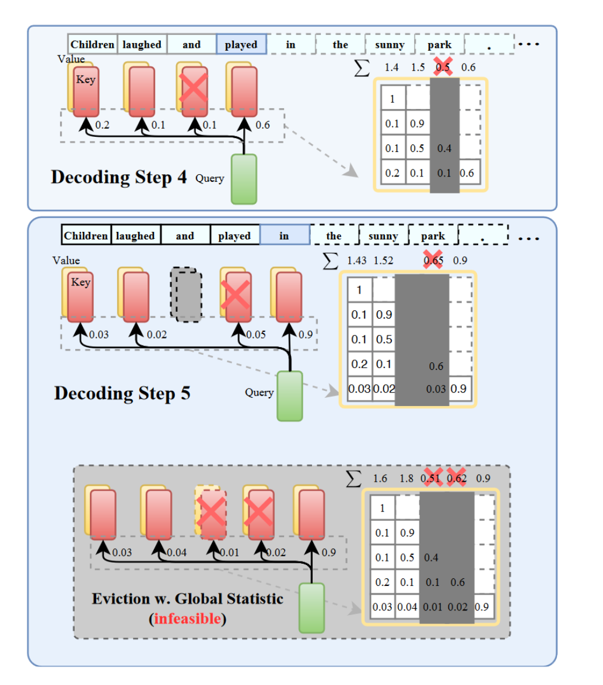
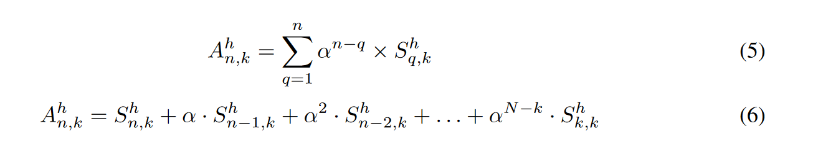
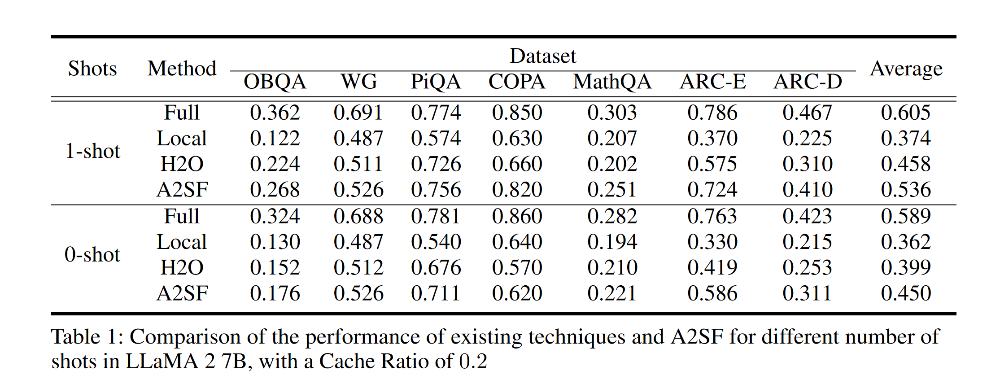
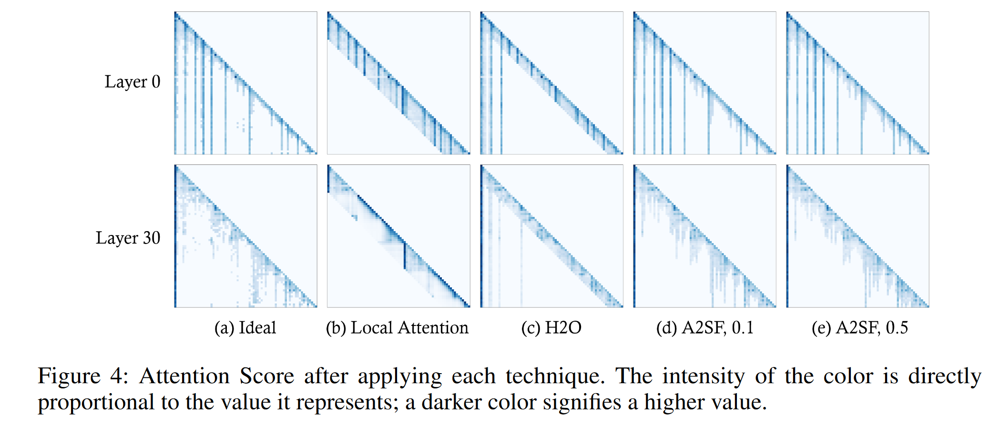
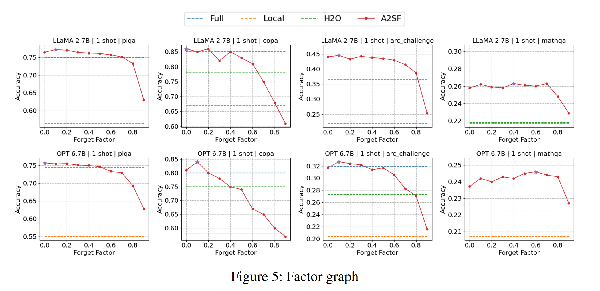
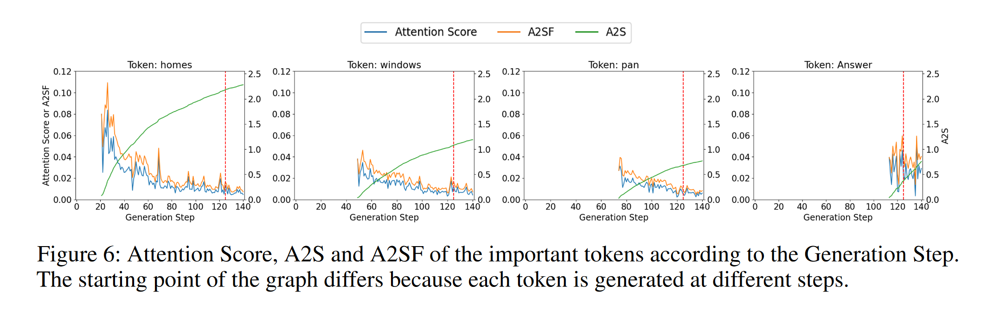

# A2SF: Accumulative Attention Scoring with Forgetting Factor for Token Pruning in Transformer Decoder
正好契合我之前的一个想法，但已经有论文了 :joy:

A2SF通过将遗忘因子与注意力分数随时间重复相乘，对旧令牌产生的过去注意力分数施加惩罚。

## 方法
由于因果编码，导致在累计注意力分数中出现了一种不平衡，较前的token总能累计更多的注意力分数，这样使得在选择重要token时，对于token重要性的衡量并不是十分准确。
下图是从H2O论文中的截图。可以看到，由于因果掩码造成的下三角注意力分数矩阵中，越靠前的token可以累计到更多次的注意力分数。

基于这个发现，作者提出遗忘因子来惩罚旧token累积的注意力分数。

> 想法其实更多的来源于强化学习中奖励的折扣因子。折扣因子的含义在于考虑多少历史信息，如果只考虑当前信息，那么折扣因子为0；如果考虑所有历史信息，那么折扣因子为1。论文中他得出的最优值是0.2，其实是个相当小的数字，考虑的历史信息确实不是很多，0.2的平方就已经是0.04了，所以这个数字大约是只考虑了两次迭代的历史信息。因为0.2这个数字收敛到0很快，所以我怀疑这个方法在长文本检索里效果不好，他也确实没给出长文本的实验结果。

## experiment

下图可以看出来遗忘因子更接近理想的注意力分布。

遗忘因子大小的影响：

可以看出考虑较短的历史信息能更准确预测重要token。下面这张图也能看出来，A2SF更加贴近原始注意力分数的变化，但是总是比原始注意力分数高一些。这样主要是避免在某一步生成步骤中，由于注意力分数过低，导致该token被剪枝，从而影响后续生成。

> 遗忘因子需要根据任务来调整，算是一个弊端。作者在future work中也提到，可能需要根据不同的头、层来选择不同的遗忘因子。
