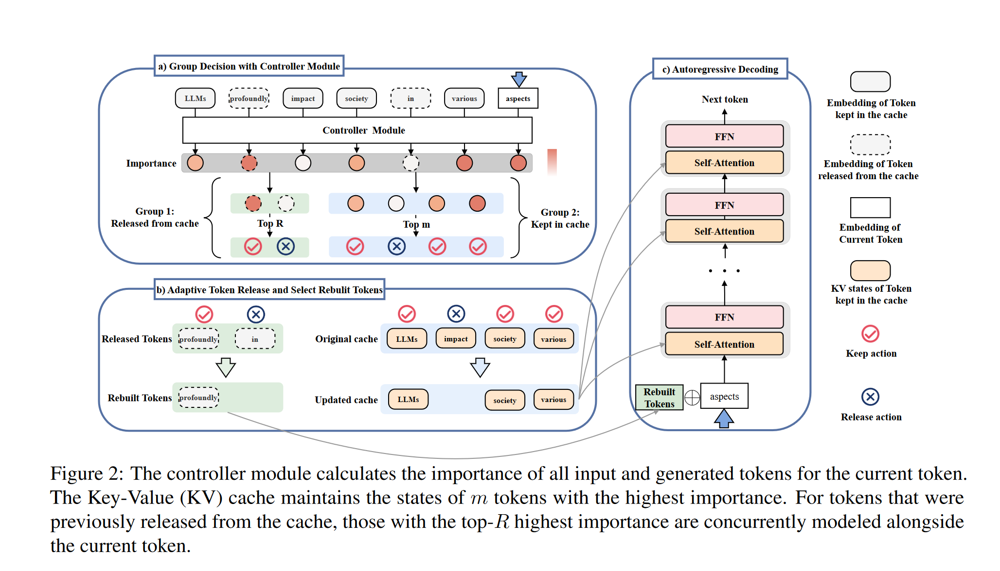
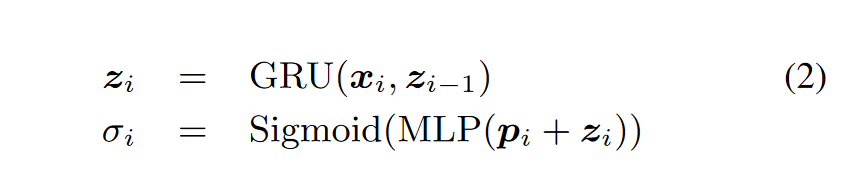
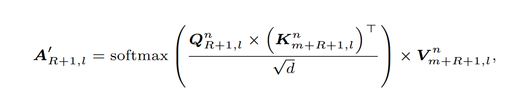

# Efficient Sparse Attention needs Adaptive Token Release
Accepted at ACL 2024

这篇论文讲得有些碎，介绍了一些思想但是没有连贯的感觉，也缺少一些实现细节的描述，所以就简要记录一下主要思想

## Method

从这个图可以看到，主要工作有两个方面：
* 通过一个可学习的Controller Module来选择重要token
* 自适应的token淘汰和重建，从淘汰token中恢复可能重要的token

### 自适应token淘汰
主要的想法是用一个轻量的控制器模块来替代划分token所需的全计算。

这里控制器的结构是一个GRU和一个MLP的结构：

$x_i$表示token embedding,$z_i$是该token的上下文感知表示，$p_i$表示位置编码，$\delta_i$是对该token的打分，在生成的过程中，最新的token会被缓存，而打分最低的token会被淘汰。

### KV状态重建
在被淘汰的token中，选取$\delta_i$分数最高的R个token,加上最新生成的token组合为query，将当前cache和这R+1个token再组合作为key和value,进行一次注意力计算。（这里m表示的是cache，R是重建token,1是最新生成的那一个token）

最后选取$A'_{R+1,l}$作为当前token的注意力值。
> 这里让我不太理解的是既然只要最新token的值，为什么还要把重建token的query也加入计算，并且以他们为query计算出的注意力有什么用处和含义论文里也没有说