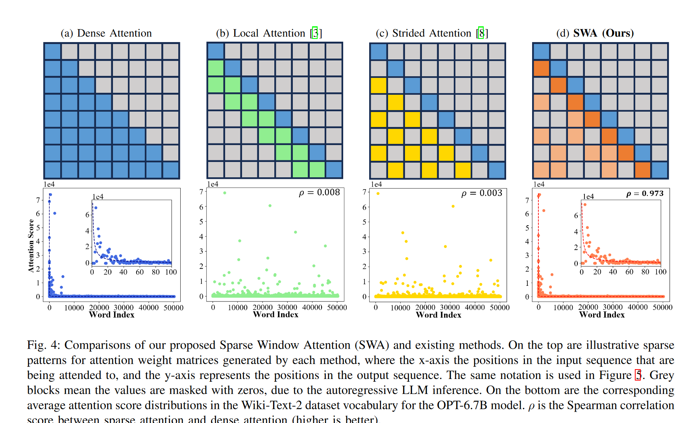
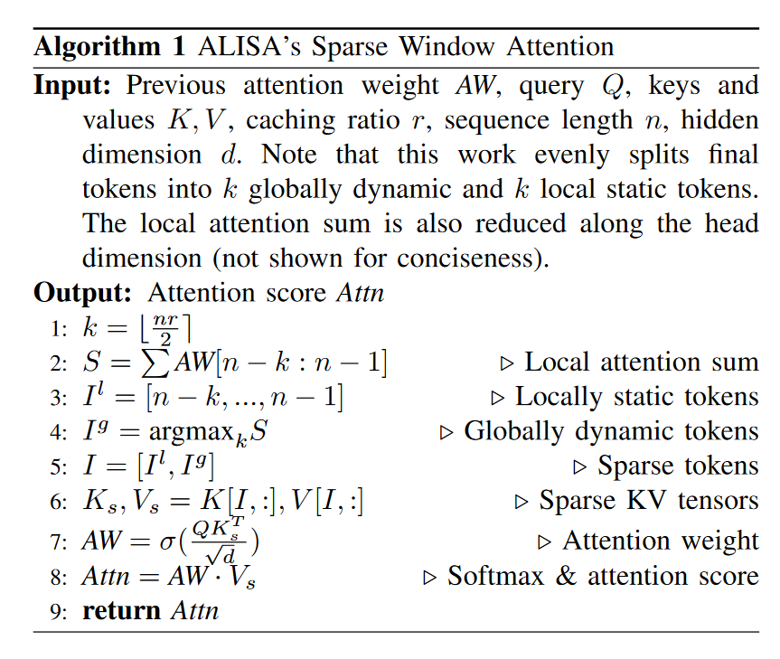
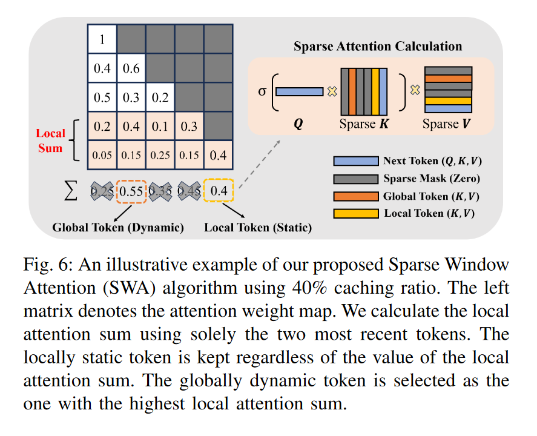
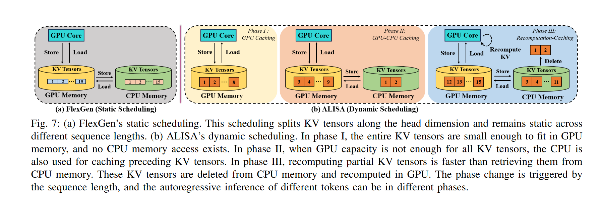
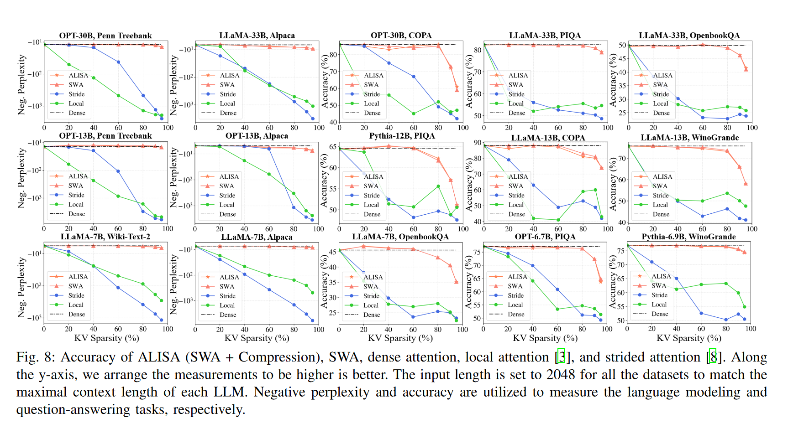
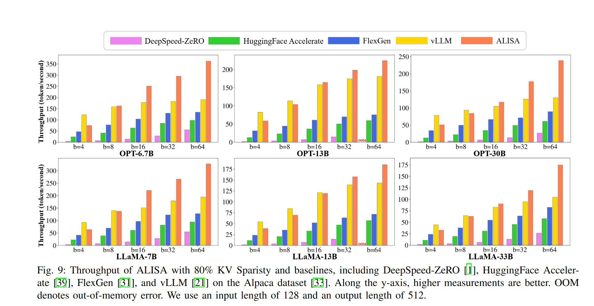
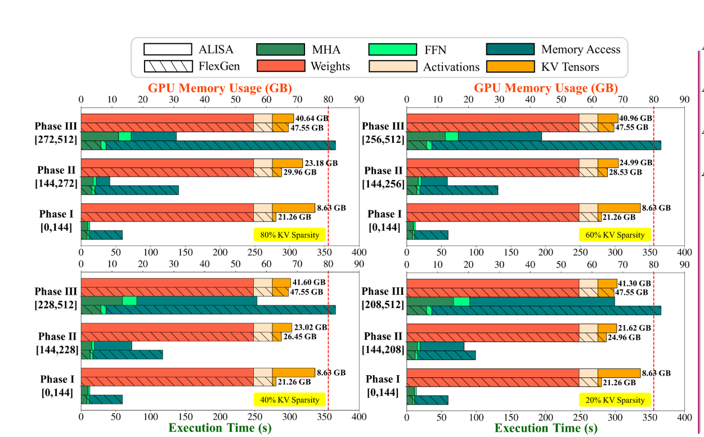
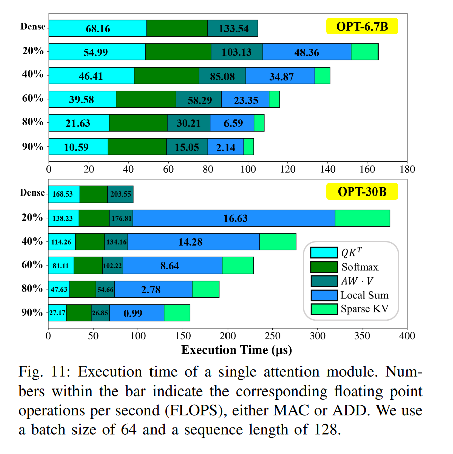

# ALISA: Accelerating Large Language Model Inference via Sparsity-Aware KV Caching
ISCA 2024

## Method

### overview
这篇文章对KV Cache的优化分为两个部分，一个是KV淘汰策略，一个是KV Cache在CPU和GPU的调度优化。

在KV淘汰策略上，方法有些类似SnapKV中的观察窗口，用local token作为query来衡量全局token的重要性。

在调度上，设计了一种三阶段的动态调度方案，基于贪心搜索来解决缓存和重计算的权衡问题。

### Sparse Window Attention

基于假设：注意力窗口内多个步骤的注意力可以比单个步骤更好的识别重要token（可以理解为一个随着生成步骤滑动的观察窗口）。上图可以发现SWA的表现最接近原始的注意力分数分布。

SWA保留的token一部分是固定的local token，一部分是根据这部分local token得到的全局重要token。这里其实也是累积注意力的方法，但是他限制了累积的范围（感觉可以使用折扣因子来平滑这个累加的过程），这样做还有一个好处是减少了求和的计算量。

他这里local token的范围比其他算法要大，将cache一半的内存都固定地分配给了local token。

### Dynamic Scheduling
把调度划分为了下面三个阶段：

不同于FlexGen的静态调度，ALISA考虑了三个阶段，并且将重计算的成本和从CPU迁移到GPU的成本进行了衡量。
在阶段一，GPU显存资源足够，全部放在GPU。
在阶段二，GPU显存资源不足，将global token放在CPU，而local token会放在GPU上。
在阶段三，需要将一定比例的KV通过重新计算来获得，而剩余的仍然从在GPU和CPU上的cache获得。
阶段转移由序列长度来决定，对于稀疏度高的情况下（可以删掉更多的KV），序列长度更长才会进入下一个阶段。

使用了贪心搜索来确定达到最佳性能的三个阶段划分标准，并且这部分工作是离线的，并不会对推理带来额外的开销。但缺点是对于不同的模型和设备，需要进行特定的优化。

### 量化
应用了8bit量化来进一步压缩KV Cache。但这里他没有什么特别的量化方法。8bit量化对于模型的损失比较小，不用太担心性能有很大损失，应该是可以应用在任何KV Cache优化方法上。

## Experiments
这篇文章的实验比较全面，主要需要评测下面几个方面的指标：
* 模型性能：需要优化后的方法和full cache相比，在准确率、语言建模等方面不能太落后于原始模型
* 吞吐速度对比
* GPU显存占用对比

### 性能

发现在某些任务上，当KV稀疏度达到较高值的时候，ALISA出现了显著的性能下滑。

### 吞吐速度
和主流的加速框架进行了对比，ALISA有着较大的优势，尤其是batch_size较大的时候。因为vLLM主要针对线上环境优化（往往batch_size较小），所以在batch_size较小时会略胜一筹。

### 显存占用
红色虚线表示GPU的显存上限。

和FlexGen相比，ALISA会更多地利用GPU显存，并且在执行时间上会比FlexGen快很多。

但和full cache相比，ALISA在执行时间上一定是会更长的。额外的计算量带来了执行时间上较大的损失。下面分析了执行时间的主要构成。当稀疏性较高的时候，额外计算开销带来的影响会减小。虽然减少了参与计算的KV,但是因为不能很好地利用GPU的大规模并行性，所以并不会在这部分的计算时间上有很大的减少。而且，相比于矩阵计算，串行的求和操作效率会低很多，占据了很大一部分的执行时间。这也从某方面验证了有些基于所有注意力权重的淘汰方法，并不具有扩展性（他们会在求和操作上耗费更多的执行时间）。

