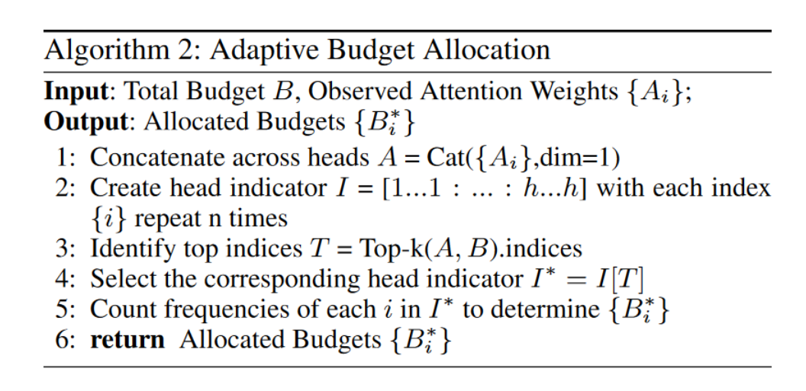
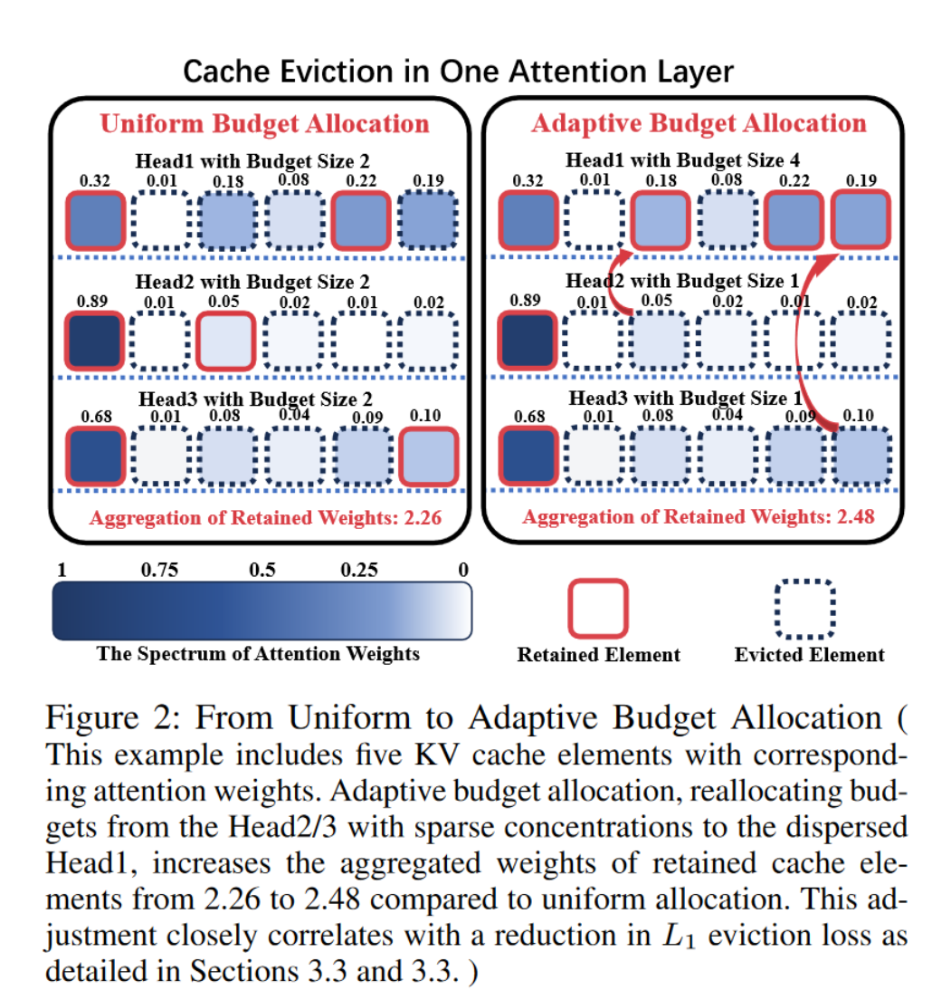

# Ada-KV: Optimizing KV Cache Eviction by Adaptive Budget Allocation for Efficient LLM Inference
这一篇是关于cache分配的，但也是基于KV淘汰

## method
首先这个方法是基于KV淘汰方法的，并且理论上可以应用于任何KV淘汰方法，作者在SnapKV和Pyramid上做的实验。

主要思想是为每一层分配大小不同的cache。做法是将每一层的attention拼接在一起，然后做top-k,根据每一层中进入top-k的个数来确定这一层的cache大小。

主要想要解决每一层的稀疏性不同的问题。给每一层分配合适的cache大小。
