# CItruS:lemon::Chunked Instruction-aware State Eviction for Long Sequence Modeling

## 问题
作者将大模型的生成过程划分为了两个子过程：语言建模和任务解决。
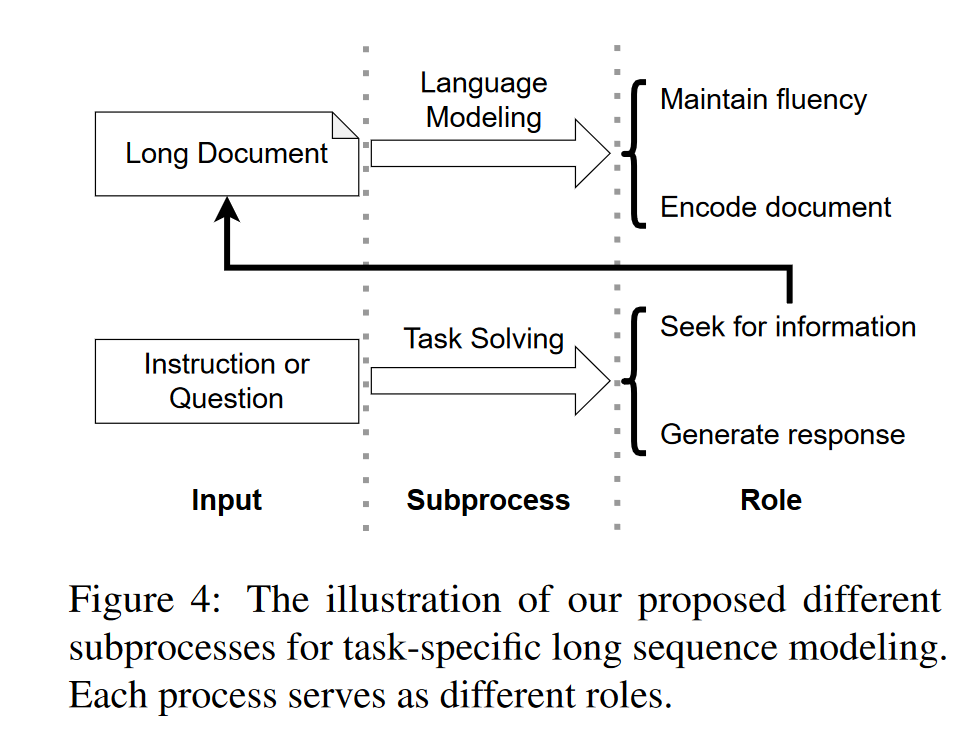

现有的KV Eviction策略常常侧重于语言建模的过程，丢失用于解决下游任务的关键信息（所谓的下游任务就是指先给了一堆文本，然后提出任务要求\问题等）。作者将这个问题称作信息忽略问题。

观察到对语言建模有用的KV state不一定是下游任务所关注的state（例如回答特定问题）

来自context的注意力和来自instruction的注意力是不同的

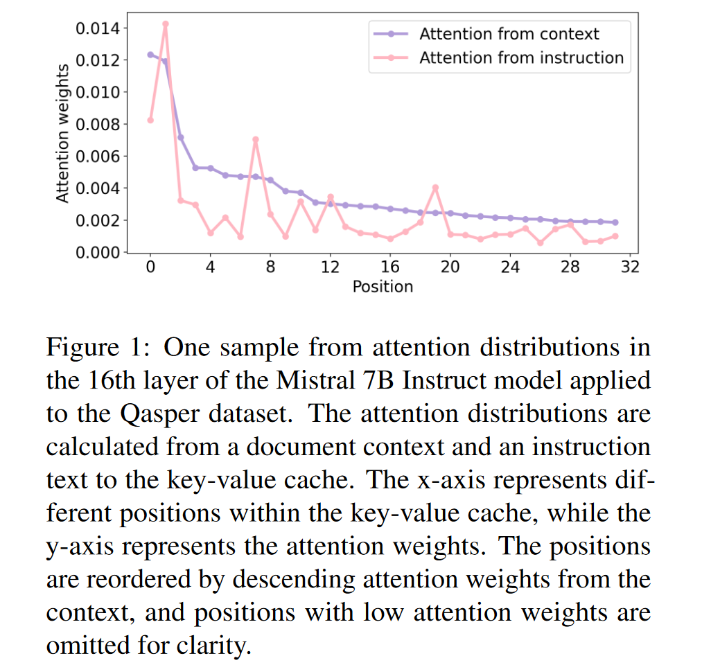

下图展示了来自context的top-k注意力和来自instruction的top-k注意力的区别:
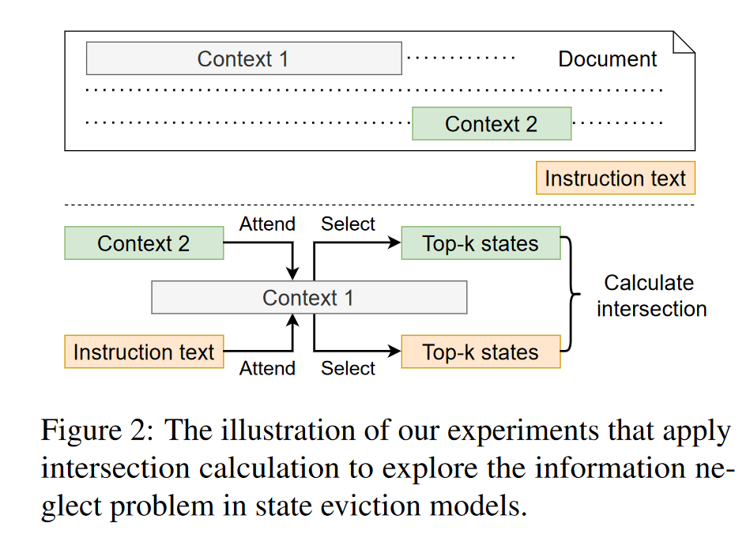
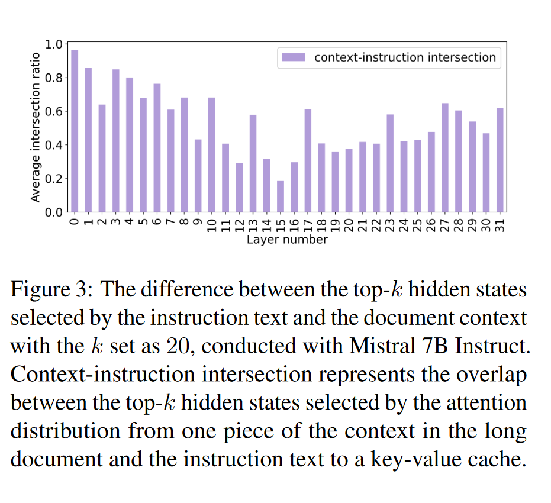

## method
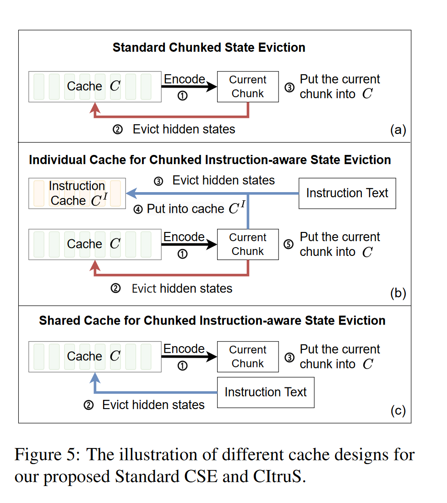

### Chunked State Eviction
在每一个chunk内部根据文档的上下文来做淘汰，淘汰的评分函数是当前层的注意力权重

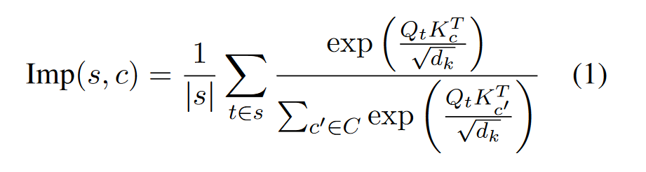
s表示chunk，c表示cache

> 作者在这里提到了他们发现在每个头上用不同的淘汰策略，效果会比较差，和一般的intuition不太一样

### Instruction-aware State Eviction
在上下文产生的cache之外，再设置一个独立的针对instruction的cache，这个cache是根据来自instruction的注意力权重来做淘汰的。

但是使用独立的cache会增加内存使用，所以他最后的做法是，直接把这个独立的cache当作正常的cache使用，简单来说就是以instruction为query来算的注意力作为淘汰的评分。这部分的计算单纯的是为了选出对于instruction重要的token，并没有把instruction加入到chunk中一起去计算（相当于一个cross attention,区别于homer中把instruction加入到每一个chunk中的做法）。

## exp
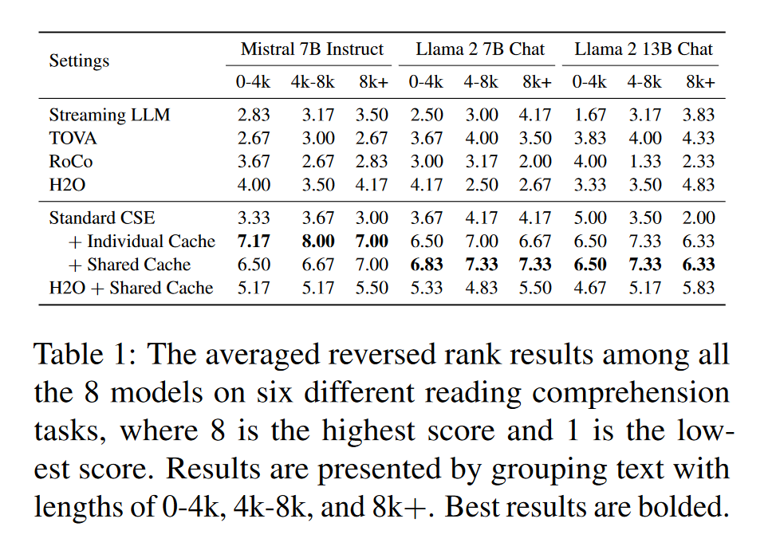

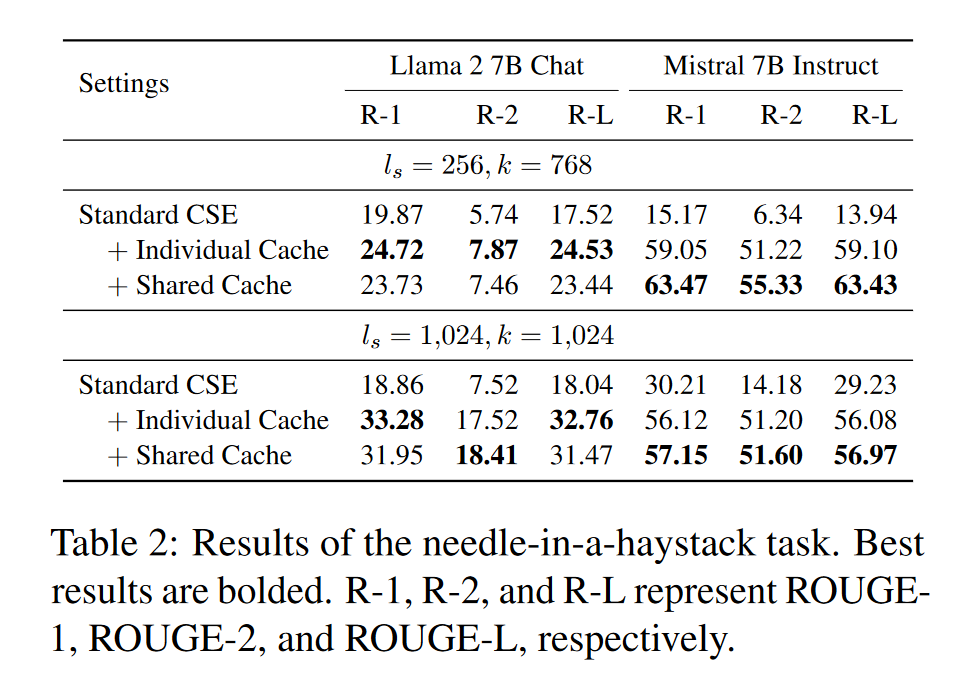

困惑度会上升，原因可能是拿instruction的注意力来裁剪KV Cache会对语言建模能力产生一点影响
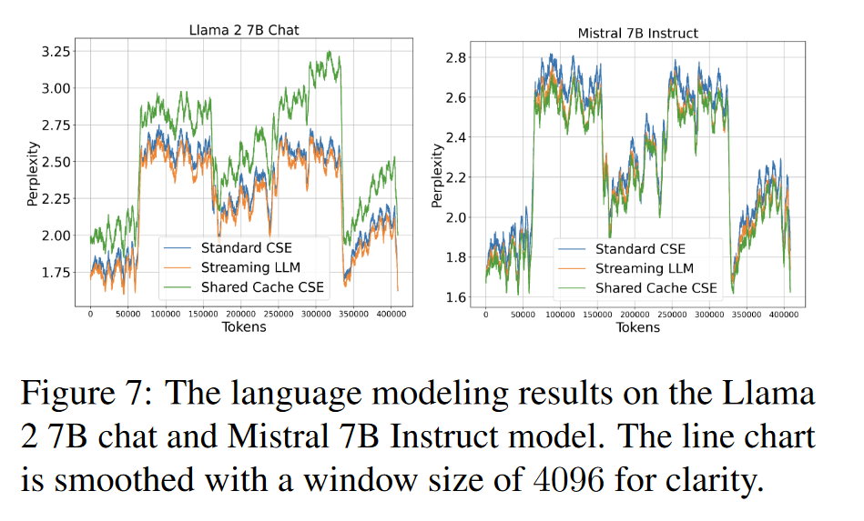

块大小和top-k中的k大小的影响：
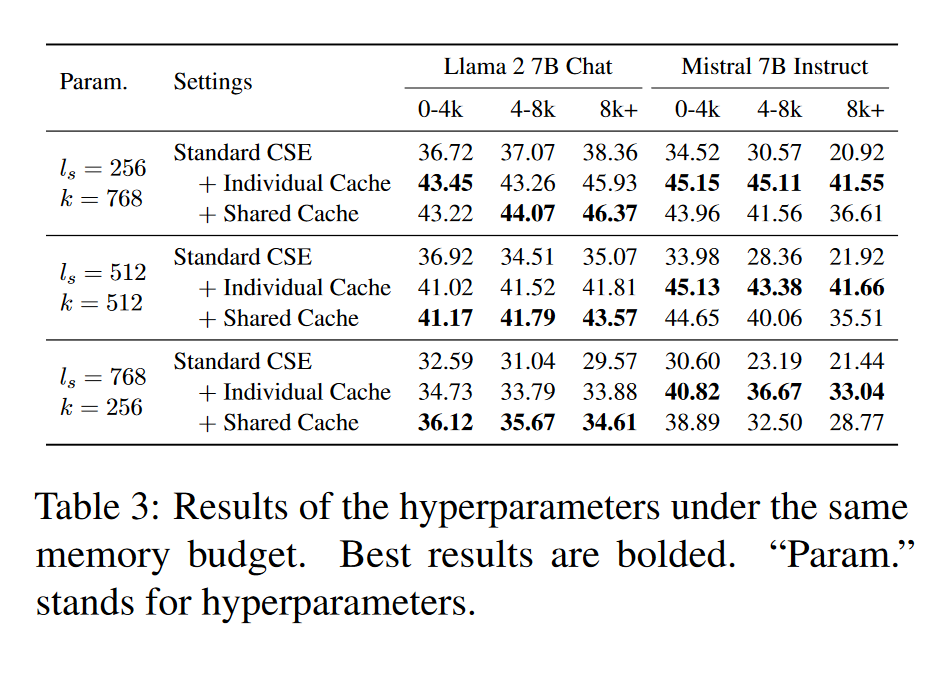

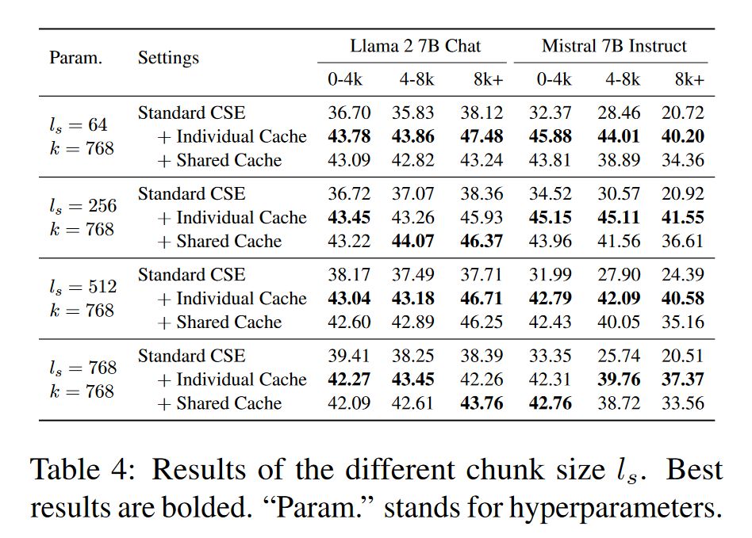