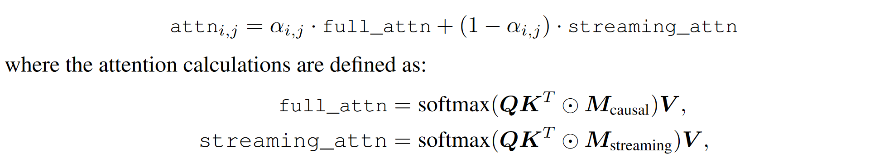
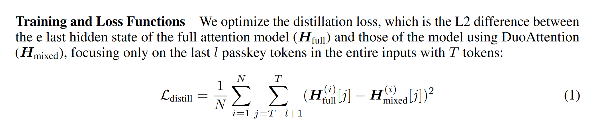
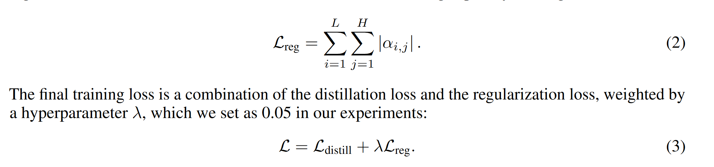
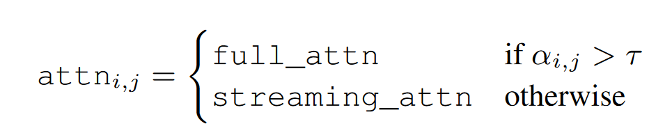
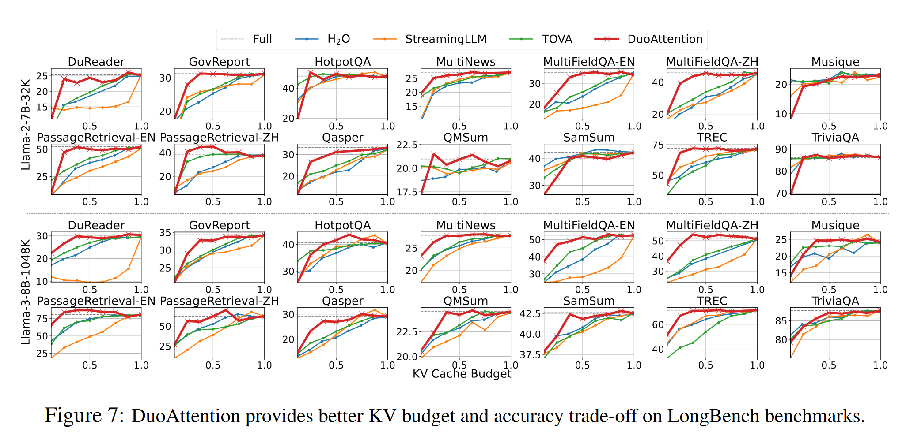
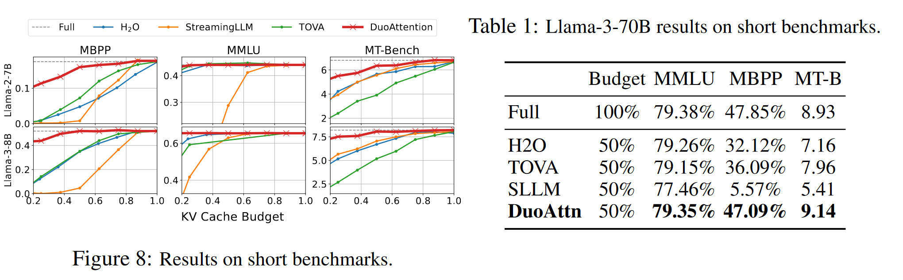
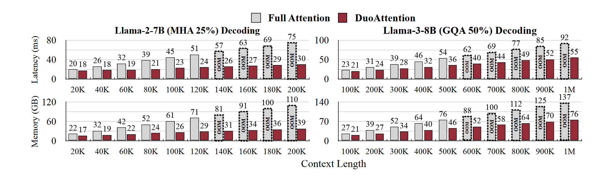

# DUOATTENTION: EFFICIENT LONG-CONTEXT LLM INFERENCE WITH RETRIEVAL AND STREAMING HEADS
关于检索头和非检索头

## method
作者将头分为两种，检索头（retrieval head）和流式头（streaming head）:
* 检索头：可以从较长的输入文本中搜索query,需要所有的token,用full cache计算
* 流式头：不需要所有的token,只用attention sink和local token来计算

与RazorAttention方法的区别是，这一篇用一组可学习的参数来判别头的类型，而不是去分析注意力的稀疏程度。

对每一头分配一个系数$\alpha_{i,j}$来区分检索头和流式头。

然后用原本的计算得出的hidden states和用这种系数控制的混合attention计算得出的hidden states的距离来作为loss去学习$\alpha_{i,j}$。

此外再加上一个正则化项来鼓励$\alpha_{i,j}$值的稀疏程度。

在实际推理的时候，会根据$\alpha_{i,j}$的值来决定是使用检索头还是流式头，注意力不会用混合方式来计算。

## experiment
长文本任务：Needle-in-a-Haystack (NIAH)、LongBench
短文本任务：MMLU, MBPP, and MT-Bench

Long Bench的实验结果：

短文本实验：

推理速度和显存占用：

因为在推理的时候，策略已经是固定的了，所以并不需要额外的计算分析，能看到不仅是内存占用变少，推理延迟也变小了（主要是数据传输量变少了）。但是这种固定的策略，感觉每个任务都要训练不同的参数。

