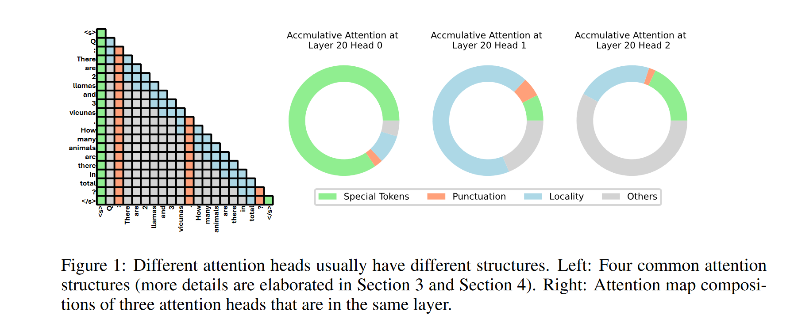
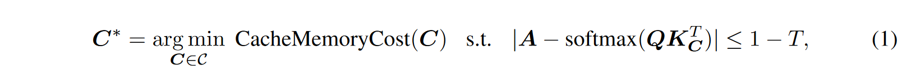
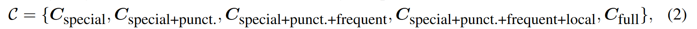
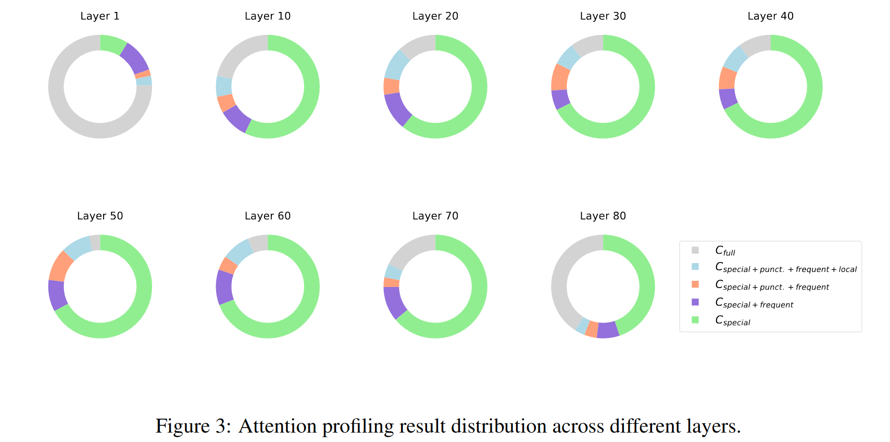

# MODEL TELLS YOU WHAT TO DISCARD: ADAPTIVE KV CACHE COMPRESSION FOR LLMS
## 主要思想

transformer中不同attention头有不同的分布特征，根据这些不同特征来确定不同的KV压缩方案

FastGen 识别了五种基本注意力结构并相应地应用它们。具体来说，一些注意力模块主要关注本地上下文，为此我们构建了一个 KV 缓存来驱逐远程上下文；有些主要关注特定的标记/标点符号，为此我们创建一个仅保留特殊标记/标点符号的 KV 缓存；有些具有按列稀疏的注意力图，为此我们丢弃最不常出现的标记；有些广泛关注所有令牌，为此我们采用标准 KV 缓存并存储所有令牌。

## 问题建模
目标是使得损失的注意力分数小于1-T并且最小化内存代价

## 压缩策略
基础的四种压缩策略：
* 只保留特殊token，比如\<s>,[INST]
* 只保留标点符号
* 保留最近token
* Heavy Hitter:根据注意力分数

本文采取了混合策略

特殊token和标点token用得比较多的原因如下：
* 总能获得较高的注意力分数
* 数量较少，内存成本低

观察可以发现，不同层的attention分布有很大的不同，因此对所有层采用固定的压缩方法并不是最优的，检测注意力模式并采取最佳的压缩方法是更为有益的。

