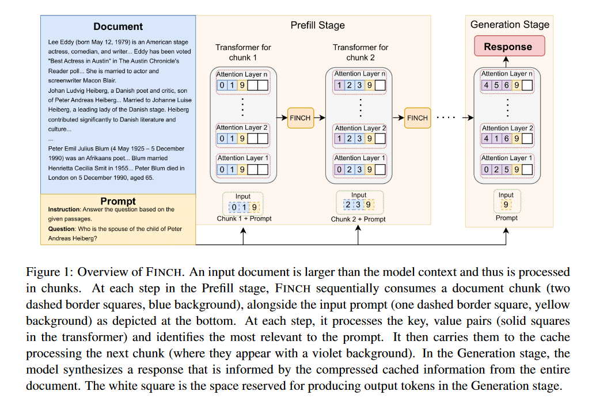
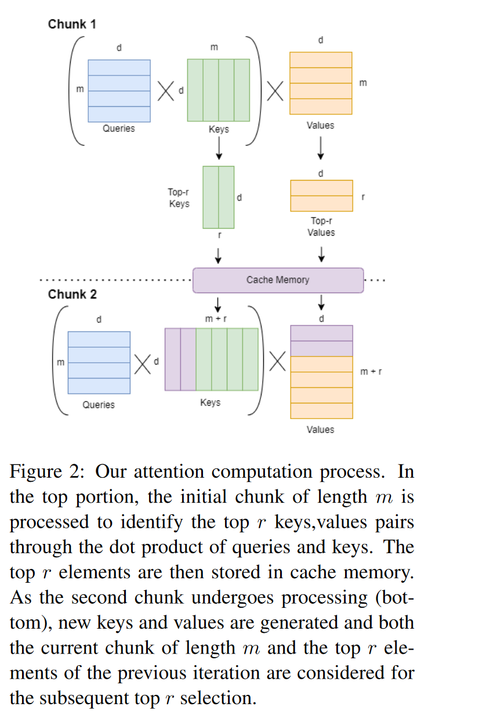
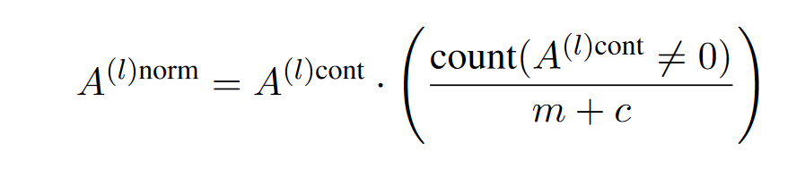
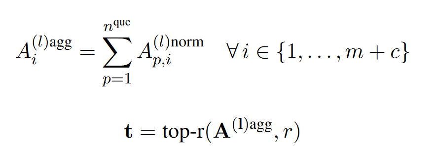
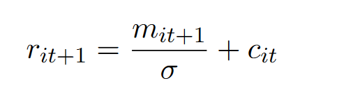

# FINCH: Prompt-guided Key-Value Cache Compression for Large Language Models

这篇文章主要是关于RAG场景下的KV Cache优化，作者提出了一种基于Prompt的KV Cache压缩方法。

> 个人认为本质上是和snapKV类似的方法。

## 方法

在RAG场景下有着超长的document用于检索，一般情况下是直接将document和用户prompt拼接在一起，然后输入给LLM。但是这种做法会导致LLM的输入长度过长，从而影响模型的性能。

作者提出了一种在预填充阶段对KV Cache进行选择性淘汰的方法。将document划分为多个chunk,按照chunk的序列，每个chunk与用户prompt做注意力运算，由此确定这个chunk中的重要token,将这些重要token对应的KV缓存下来并用于下一个chunk的处理，这样一直到最后一个chunk，得到一个关于document信息的压缩KV cache。

在这个过程中保留的KV被视作模型的语义记忆，document被缩减到这些重要token用于后续的文本生成，这也能解释为什么在某些任务上，压缩后的KV cache比原始的full cache效果更好。

下面是论文中提到的一些技术细节

### 文档分段

大模型的输入受限于上下文窗口，用$n_{max}$来表示，假设用户prompt的长度为k,那么文档的一段最多为$n_{max}-k$。在每一段的处理中，逐步添加KV Cache的内容，直到生成时，满足cache的预算。

这里提到了对于不同的任务，需要权衡不同的分段大小，小段带来细粒度，大段带来高吞吐。

### 基于prompt的层级选择

考虑了每一层对于输入的独特作用，每一层根据层的注意力分数来选择前r重要的KV。作者认为每一层token之间的相关性并不是一致的，当前层重要不代表在后面的层中仍然重要。

> 区别于Keyformer以及后续多篇文章采用的累计注意力分数，这些文章认为注意力模式在层之间也是保持相似的模式。

此外，作者还考虑了attention机制中与生俱来的对于初始token的偏好。具体来说，在因果模型中，token所能观察到的范围受限于位置，因而初始token的注意力分数会更高。靠后的token可能同等甚至更加重要，但是因为位置的限制，其注意力分数会相对较低。为了解决这一问题作者加入了归一化步骤来确保每一个token的相关性被平等的考虑。

> 在streamingLLM中，基于对注意力分数分布的观察，特地强调了初始token的重要性，而在这一篇论文中，作者认为这是因果模型的缺陷，应该尽量缓解这种缺陷造成的对于后续token的不公平评价。这两种完全相反的观点，个人认为后者似乎更有道理，对于多数情况下意义不大的初始token，却得到极高的注意力分数，确实不太合理，并且在streamingLLM中,已经证明了这种较高的注意力分数来源于位置而不是语义信息。

归一化方法：

选取当前chunk和KV cache中attention分数最高的token来更新KV cache。（这里的累计注意力是沿query方向的累计，而不是沿layer方向的累计）

r在每一次迭代（计算一个chunk算一次迭代）中动态的更新（均匀的增加r使得生成时的cache等于预算的cache大小）

