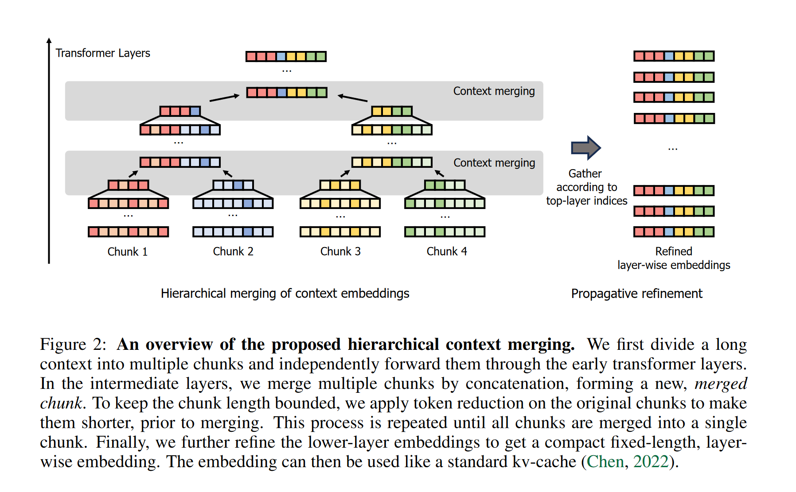
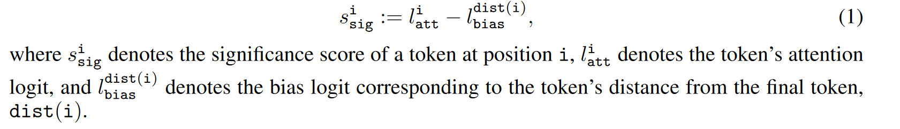
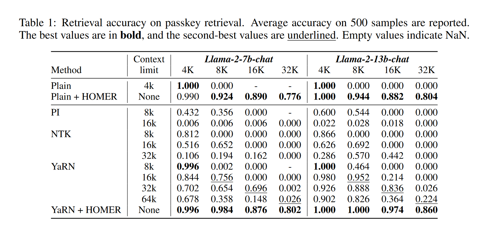
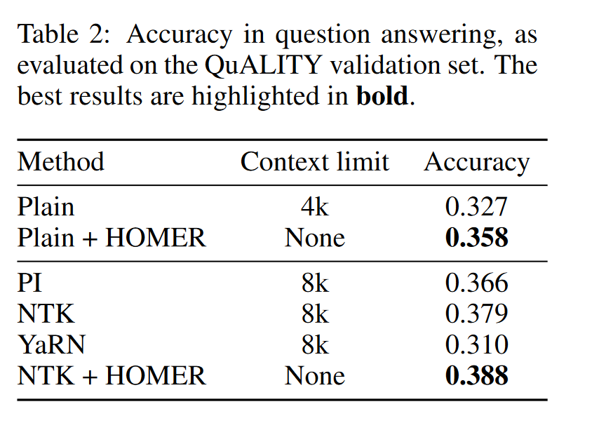
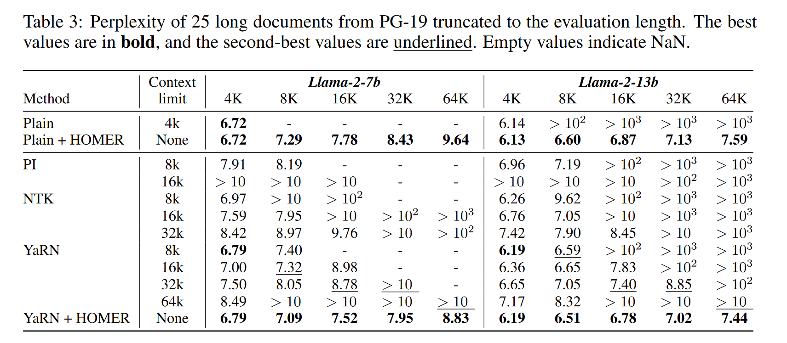

# HIERARCHICAL CONTEXT MERGING: BETTER LONG CONTEXT UNDERSTANDING FOR PRE-TRAINED LLMS
Accepted to ICLR 2024
HOMER提出了一种层次化的KV淘汰策略，虽然标题里说的是merging,但这里的merging是指对chunk进行拼接，区别于一般说的token级别的merging,所以这一篇其实还是关于KV淘汰的文章。

## 方法
### 总览

可以看到这是一种沿着transformer层方向的KV淘汰策略。prompt被切分成多个chunk，为了避免独立计算造成上下文信息的丢失，prompt的开始和结束的部分token被加到每一个chunk的开头和结尾。随着层数的递进，每两个chunk在修剪完后被拼接到一起，最终形成一个包含长文本所有关键信息的KV Cache。

### 淘汰策略的评分方法
这里在每一个chunk内进行淘汰，区别于流行的累计注意力，这里作者提出每一个chunk里从最后一个token那里得到最低注意力分数的token被淘汰。同时为了缓解靠后token倾向于得到较高的注意力权重，作者加入了标准化，将最后一个token关于前面每个位置token的注意力分数平均，作为bias logits,然后这个chunk中所有attention logits减去这个bias logits。

### 位置编码
关于位置编码，这里采用token在原prompt的位置来计算（有的研究会采用cache中的位置来计算位置编码）

### 低层嵌入的传播优化
直觉上，上层网络学习到的是更高层次的语义信息，有着更好辨识重要token的能力，所以在对上层进行token裁剪的时候，也会去裁剪该token在低层网络中的缓存，将高层的裁剪决策反向传播到低层。

## 实验
### 长文本检索
任务：passkey retrieval,检测是否能准确提取长文本信息

这里PI,NTK,YaRN都是较新的用于扩大模型上下文窗口大小的方法。

### QA
任务：QuALITY，基于长文档的问答

### 语言建模
任务：PG-19,指标为困惑度

