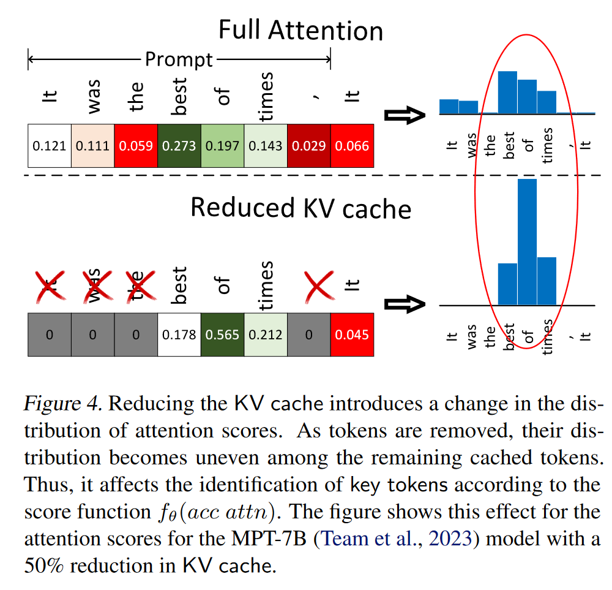
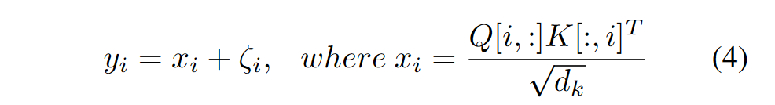
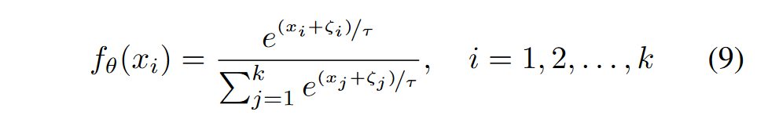
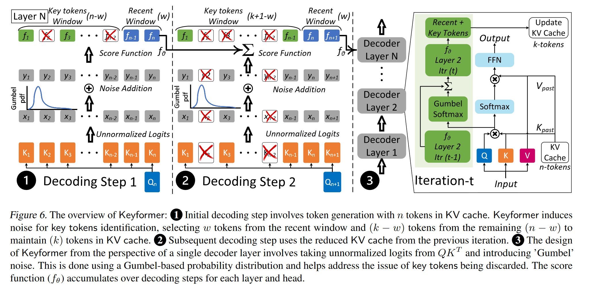

# KEYFORMER: KV CACHE REDUCTION THROUGH KEY TOKENS SELECTION FOR EFFICIENT GENERATIVE INFERENCE
在H2O的研究里就已经揭示了在KV Cache中，只有部分关键token起到了主要作用。但是H2O仅用注意力分数来判断关键token，而没有考虑丢弃标记对注意力分数的影响。

无论是“窗口注意力”还是“关键注意力”，在性能上都逊于全注意力。这种下降主要源于关键标记注意力中近期上下文的丢失和窗口注意力中关键上下文的缺失。基于这一观察，我们提出了一种混合方法，将选定的关键标记与近期标记相结合，以在减少KV缓存大小的同时保持准确性。

可以看到由于缺失token，导致没有被淘汰token的注意力分数分布发生了变化

## 对数几率正则化
在提示处理阶段，我们策略性地从上下文中移除了n-k个令牌，这有助于我们在生成过程中保持一个恒定的KV缓存大小（包含k个令牌），并防止不必要的内存扩展。之后，Keyformer使用对数几率正则化技术。通过引入额外的分布（ζ）来正则化减少的对数几率，使模型保持鲁棒性和适应性。即使在推理过程中存在未知上下文的情况下，它也能帮助识别关键令牌。Keyformer将这种噪声添加到从QKT派生的未归一化对数几率中，如图4所示。此外，添加的分布类型对最终的概率分布产生显著影响。

## Gumbel分布
我们选择的分布受到Gumbel分布（Cooray，2010年）的启发。Gumbel分布特别适合我们的关键标记识别任务，因为它描述了样本集中最大值的分布，并且偏向于初始标记。这使得它成为长序列中建模关键标记的理想选择。

## KeyFormer
我们为Keyformer提出了一个新颖的评分函数，记作fθ(Keyformer)，以解决基于累积注意力的评分函数（fθ(acc attn)）的局限性。这个新的评分函数将Gumbel噪声分布整合到未归一化的logits中。然而，它在形成基础概率分布时未能考虑被丢弃的标记。为了纠正这一点，我们引入了一个温度参数，记作τ

## 累计评分
评分函数的累积对于基于其在整个解码步骤中的一致行为来识别关键标记是至关重要的。如果没有累积，标记仅依赖于当前标记与先前标记的相关性。尽管当前标记的相关性在识别关键标记方面很重要，但它们在大多数生成的标记中应该保持一致的行为。为了基于这种一致的行为来识别关键标记，我们在提示阶段和标记生成阶段都累积评分函数（fθ），如图6所示。

