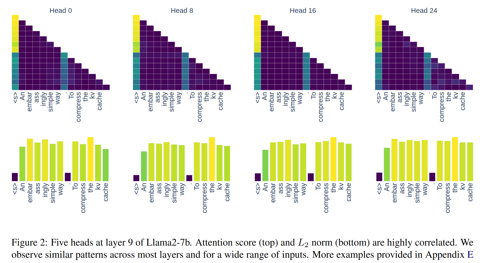
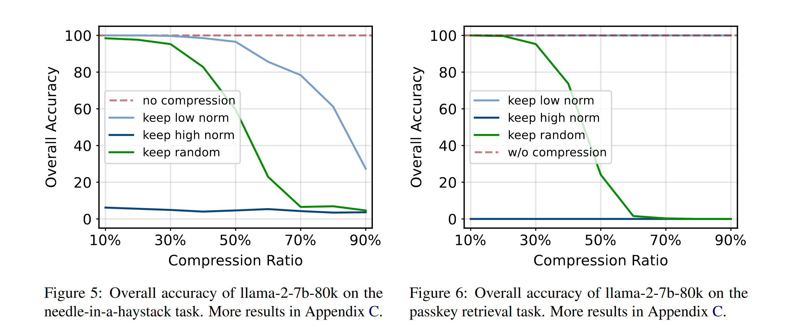

# A Simple and Effective L2 Norm-Based Strategy for KV Cache Compression
L2 Norm更小的key对应注意力分数更高

因此，只保留L2 Norm最小的key和对应的value

## exp
实验方法：作者将丢弃最大L2 Norm的Keys产生的注意力分数损失与理想情况下（即只丢弃最小注意力分数的keys产生的损失）进行对比

