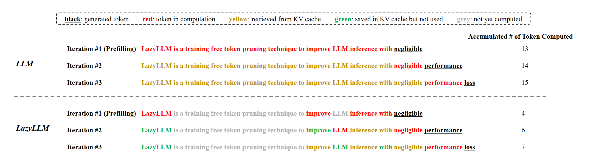
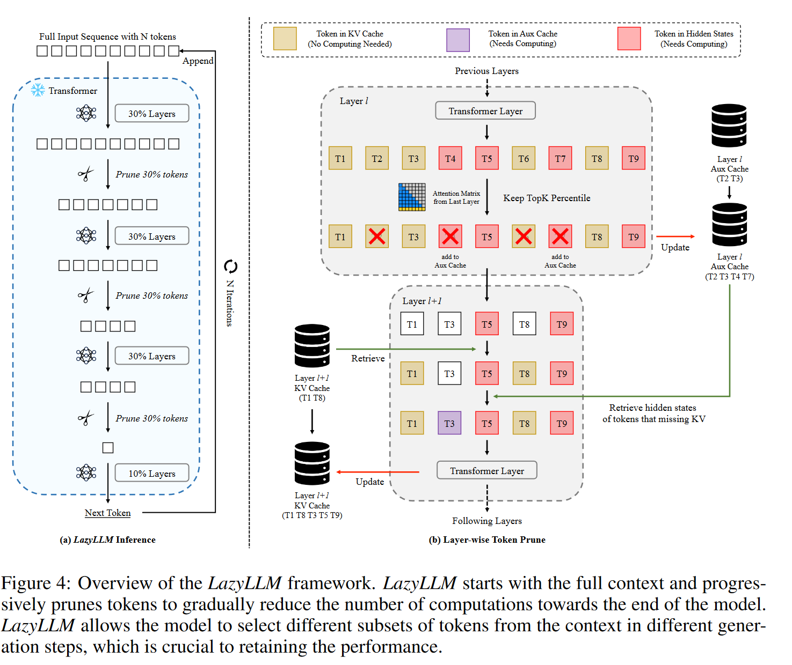
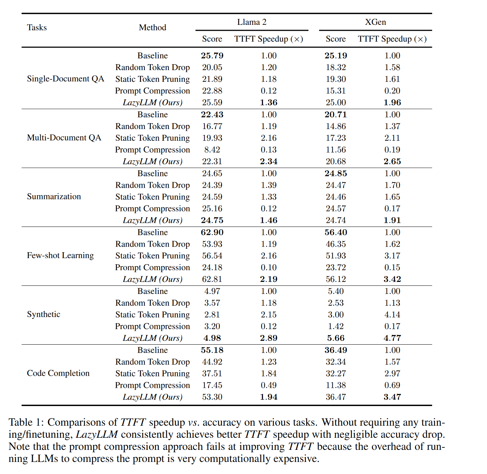
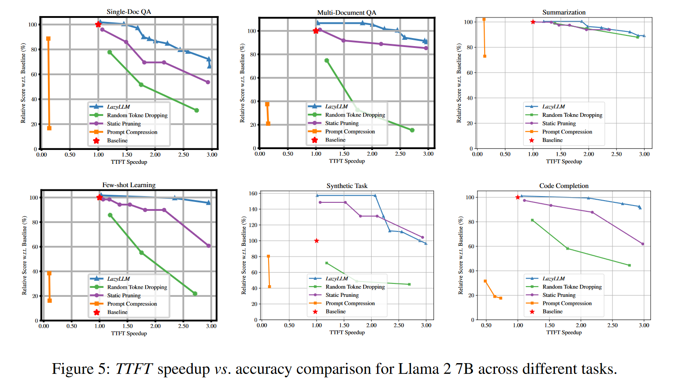
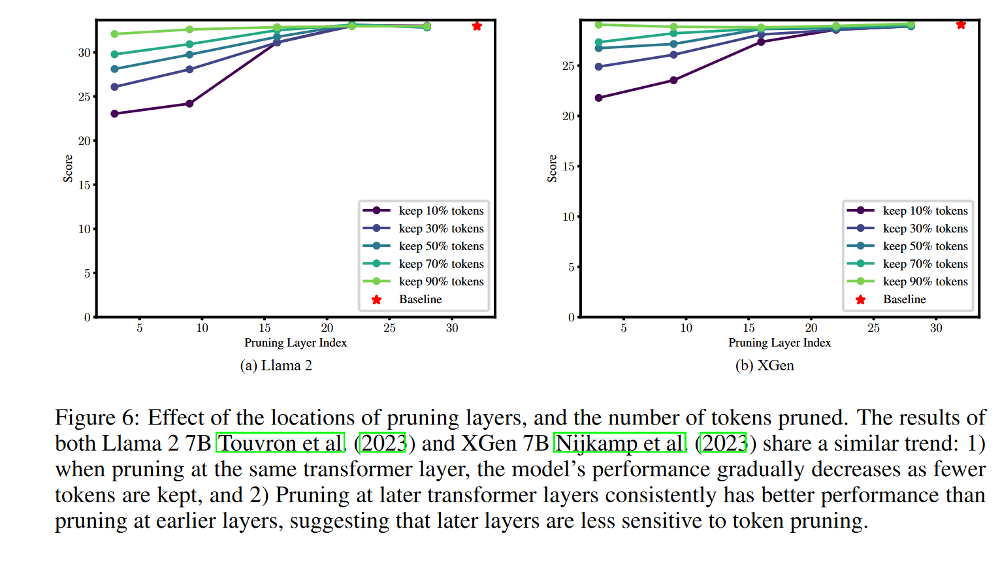

# LazyLLM: DYNAMIC TOKEN PRUNING FOR EFFICIENT LONG CONTEXT LLM INFERENCE
问题是，是否所有的prompt token都是生成第一个token所必需的。为了回答这个问题，我们提出了一种新的方法，LazyLLM，它在预填充和解码阶段选择性地计算对下一个令牌预测重要的令牌的KV。

* 使用前一个Transformer层的注意力分数来衡量token的重要性，并随着深度增加逐步修剪token。

* 允许模型恢复先前修剪过的令牌

## LazyLLM
lazyLLM并不在prefilling阶段计算所有的token,而是推迟部分到解码阶段去计算，这样的目的是显著减少TTFT。

LazyLLM从完整上下文开始，逐步剪枝令牌，以逐步减少计算次数，直至模型结束。值得注意的是，LazyLLM允许模型在不同的生成步骤中从上下文中选择不同的令牌子集，尽管其中一些令牌可能在前一步中被剪枝。

LazyLLM从推理(预填充步骤)的第1次迭代开始，只"偷懒"地计算对预测下一个令牌很重要的令牌，用l层的平均注意力分数来确定l+1层的重要token。这里采用了top-k策略，只保留k个最重要的token，其余的token被剪枝。

考虑到一些在层的前向传播中被剪枝的token,如果丢弃他们就需要让他们从头开始计算，为了避免重复的计算，作者定义了Aux Cache，用于存储被剪枝的token，以便在需要时恢复它们。

## experiment
评测数据集：[LongBench](https://github.com/THUDM/LongBench)

评测模型：Llama-2 7B,XGen-7B

评测结果：

在多篇论文里都有提到，对于后面层进行剪枝，不会对准确率有很大影响，所以对于前面层的cache可以尽量存储，对于后面层可以多删除一些token。