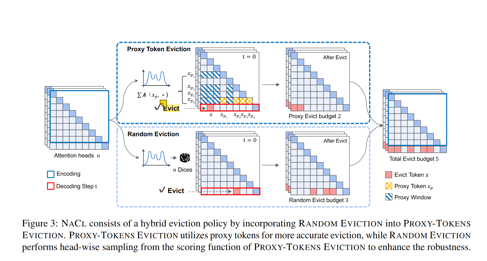
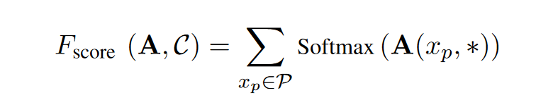
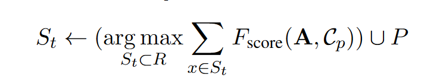
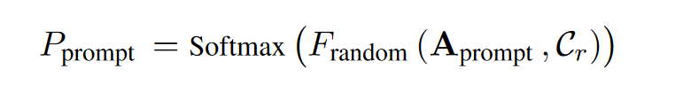
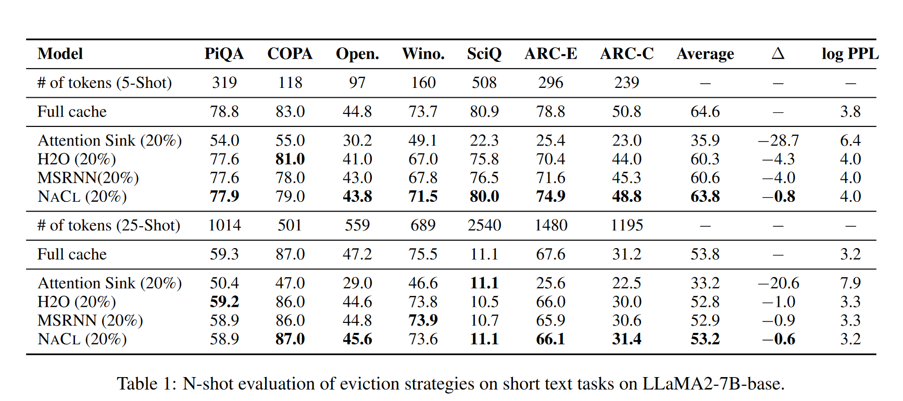
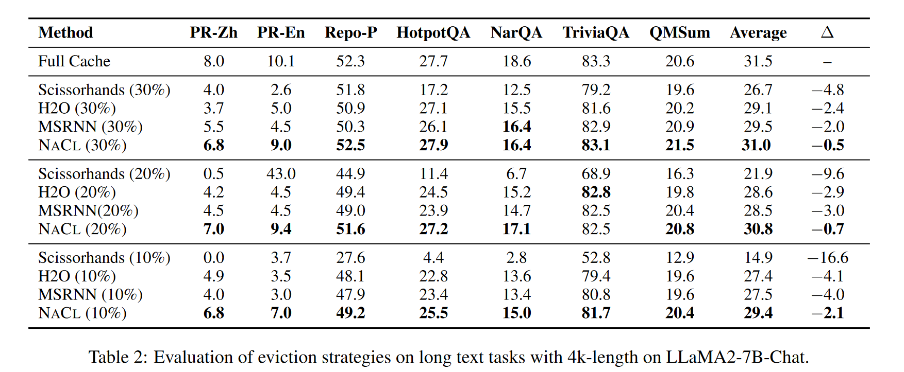
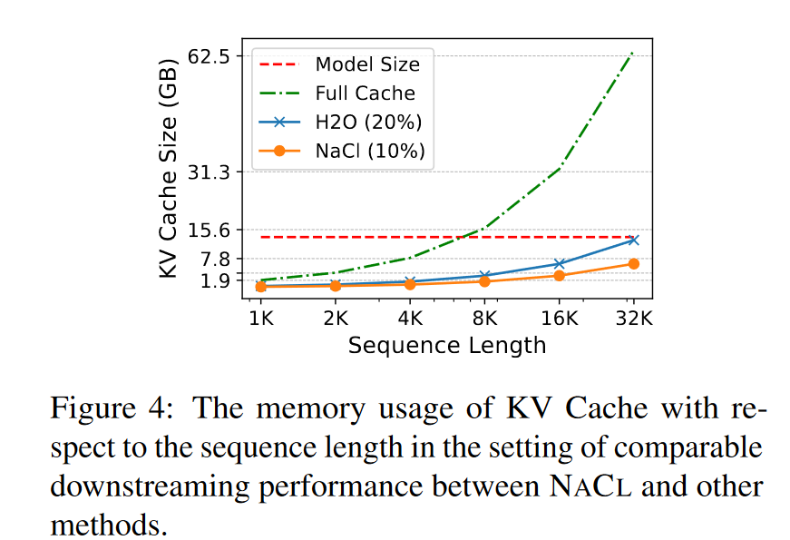

# NACL: A General and Effective KV Cache Eviction Framework for LLMs at Inference Time
Accepted by ACL 2024 (main conference, long paper)

## Observation
* 目前现有的累计注意力方法，随着token的生成过程，会倾向于在初始token上累积较高的注意力分数，虽然有加上normalization，但是效果并不是很好
* PPL并不是一个全面的评价指标，有些方法虽然PPL较低，但是生成内容并不准确

## method
这篇是关于token淘汰的方法，主要有两部分构成，一部分是proxy-token eviction,另一部分是random token eviction

### proxy-token eviction
首先介绍一下什么是proxy-token。proxy-token指得是使得预测重要token最准确的用作query的那一些token,一般这些token位于prompt的末尾，用他们作为query计算出来的注意力分数能够较为准确地反映token的重要程度。
> 其实就是SnapKV中observation window,并且作者也在limitations中说这里的proxy token是根据经验来选择的，那其实就是直接取prompt的末尾部分token作为proxy token

作者认为累积注意力的计算是有偏差的，这来源于在处理过程中的大量冗余信息。所以应该用proxy token来评分
> 我个人的理解是把prompt的问题部分用作query来算重要token应该是比较准确的，如果把模型理解为一个搜索引擎，那么只要给出问题，应该就已经得到了答案，而不需要等模型一个token一个token的吐出答案，当然decoder的结构是逐个token生成，但应该在生成第一个token的时候，模型就已经知道了完整的答案。

评分函数，其中$x_p$表示proxy token 。

其中$C_p$表示给proxy-token eviction策略预留的cache大小，后面还会提到$C_r$，表示给random token eviction预留的cache大小，而整个NACL框架的cache预算表示为$C=C_p+C_r$。

### random token eviction
random token eviction是根据一定的概率分布来随机采样留存的token，留存的token数量为$C_r$。这里的概率分布也是按照token的相对重要性来生成的，论文并没有给出$F_random$是什么，估计应该是某种累计注意力方法。

通过从概率分布中随机采样，目的在于增强模型恢复和保持原本可能丢失的重要信息的能力。

从概率的角度来看，淘汰策略是做在注意力头这个层级上的，令牌基本上是不可能完全被驱逐的。以具有32层和32头的LLaMA - 7B为例，令牌保留在至少一个头的KV缓存中的概率为99.92 %

## experiments
在短文本和长文本上表现良好

显存占用也很低

但是没有测吞吐率和延迟。