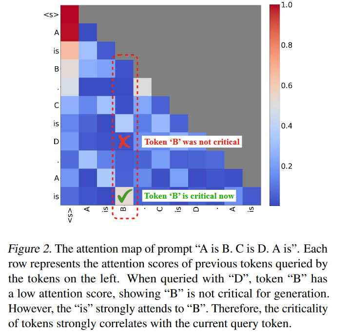

# Quest: Query-Aware Sparsity for Efficient Long-Context LLM Inference
观察到令牌的关键性高度依赖于query。为此提出了一种查询感知的KV缓存选择算法Quest

## 方法

作者认为注意分分数与query有很大的相关性，比如对于prompt:"A is B. C is D. A is"。在D作为query的时候，B的注意力分数较低；然后当is是query的时候，B的注意力分数较高。作者用召回率来量化这一发现的影响，对于全cache,召回率是100%，而H2O的召回率就很低，Quest维持了较高的召回率。

那么问题来到了如何根据query来确定重要的key。
### 动态评价token重要性
首先，Quest是基于vLLM的分页思想实现，以页为单位决定key是保留还是丢弃。Quest方法分为两个阶段。

第一个阶段是估算重要的页，具体的做法是把一页key的每个channel的最大值和最小值分别选出来形成两个新的向量，然后和query做向量积得到两个注意力权重（还没有经过softmax），选择较大的向量作为这一页key的注意力权重上界（这样得出的注意力权重肯定大于等于任何一个key的注意力权重）。最后将权重上界的每个元素相加，作为这一页重要性的评判依据。

第二个阶段是根据上一步对每一页的重要性进行排序，然后选择前k页的key保留下来，执行正常的注意力运算。这样按页载入key的一大好处就是提高了数据读取速度，减少了内存中数据的移动，并且可以以页为单位来定义cache开销。

## experiments
实验效果：7.03倍自注意力加速比，减少推理延迟2.23倍

长文本检索测试：

困惑度：

不同页大小的延迟&不同cache预算的延迟：

结合量化对延迟可以得到进一步的提升
