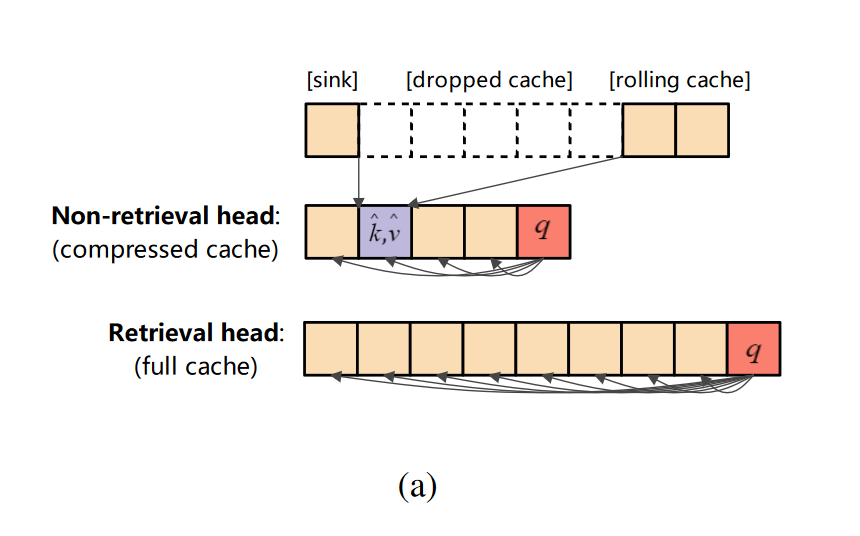

# RAZORATTENTION: EFFICIENT KV CACHE COMPRESSION THROUGH RETRIEVAL HEADS
* 一种免训练的 KV 缓存压缩算法，它为这些关键的检索头维护完整的缓存，并丢弃非检索头中的较远token,实现3倍压缩。
* “补偿令牌”以进一步恢复丢弃的令牌中的信息。
* 与FlashAttention兼容

## background
发现LLM中存在一种**检索和处理**的机制。具体来说，作者认为有两种类型的注意力头：
* 检索头：可以从较长的输入文本中搜索query
* 非检索头：主要关注临近文本和attention sink

## RazorAttention
对于检索头保留全部的cache

对于非检索头，应用StreamingLLM中的淘汰方法，即只保留临近token和attention sink中的token

### 检索头识别
只有大约 15% 的注意力头（我们称之为检索头部）能够有效利用远程信息，而其余头部仅关注局部上下文。

为了识别检索头，生成 K（例如，K = 2500）个随机标记，重复这些标记 4 次，然后将其用作模型的输入。这种设计最大限度地减少了标记之间的语义依赖性，从而可以更清晰地观察回声和感应头的行为。
> 通过实验统计的方法来检索，也就说对于不同的模型，这一环节需要重复进行，并且这些头是否在不同任务中都扮演一致的角色存疑

### compensation token
对于非检索头，需要丢弃在头部和临近token之间的那部分token,为了减少丢弃token带来的损失，作者提出compensation token:对丢弃token的KV值取平均插入到删除部分

## exp
一堆语言任务的结果

和H2O的长文本对比结果

compensation token消融实验

