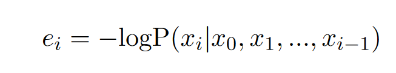
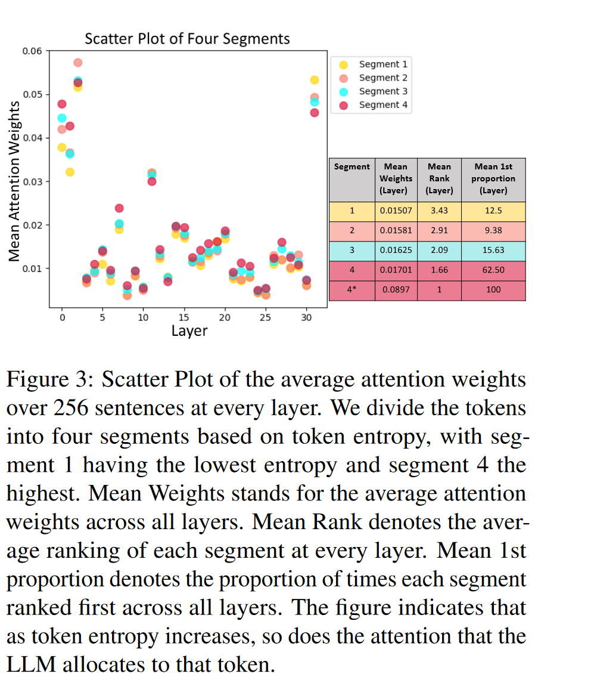

# SirLLM: Streaming Infinite Retentive LLM

SirLLM利用Token Entropy度量和记忆衰减机制过滤关键短语，使LLM同时具有持久和灵活的记忆性。

## Token Entropy

token熵定义为：

熵越高表示信息越多，因此也更重要。

并且LLM在生成过程中可以输出每个token的概率，这样并不需要额外的计算。

作者对token熵和注意力分数的大小关系进行了实验。这里将token根据熵分成了四个段。

> 看这个图感觉熵大确实注意力分数会高，但是这个比例并不是很大，可以看到segment 4最高注意力只占62.5%，而segment 1最高注意力占12.5%，熵对于注意力分数的判断并不是很准确。

## Streaming Infinite Retentive LLM

作者提出了一个简单的机制，在LLM生成过程中，根据token的熵大小，选择保留的token。有几个技术细节：

* 为了避免重复计算熵，需要一个保存熵的cache
* 位置编码采取token在cache中的位置来计算
* 熵cache在每一轮对话后衰减
