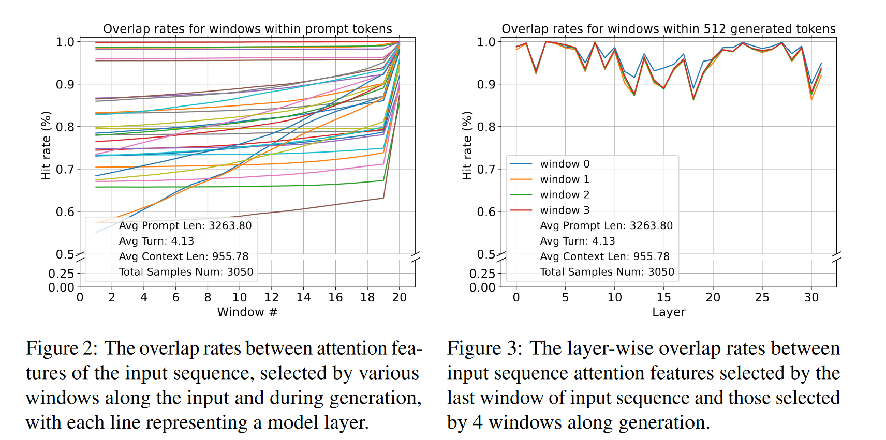
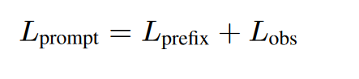
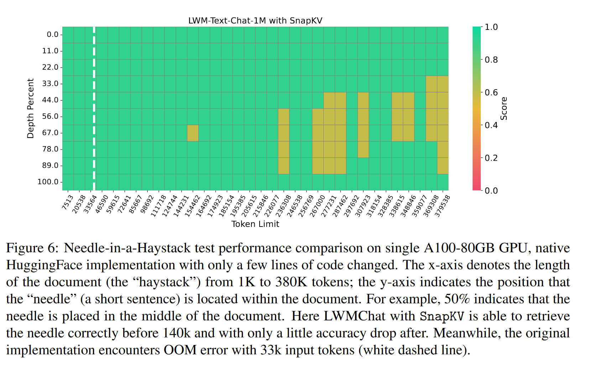
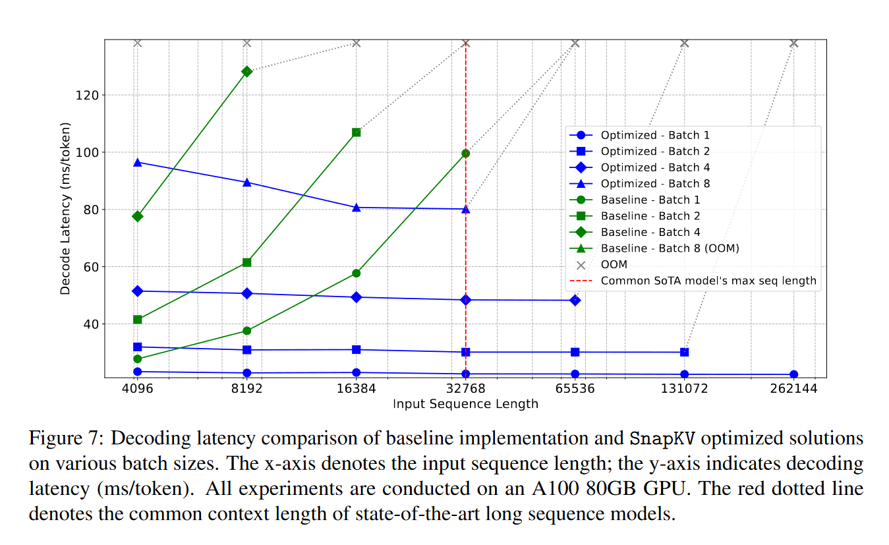
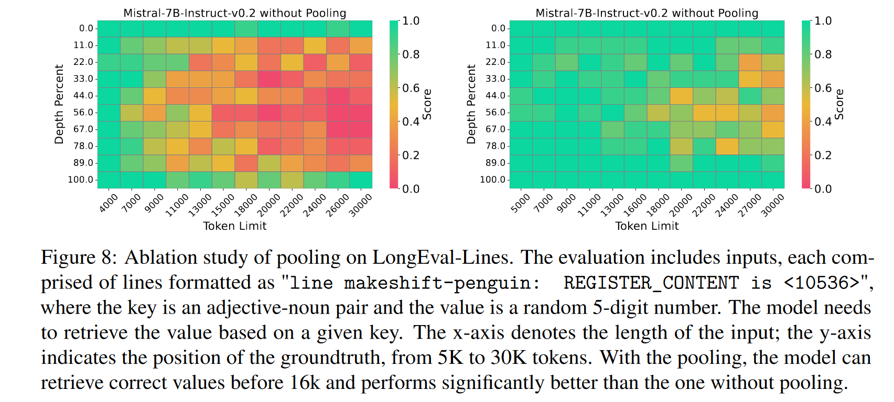
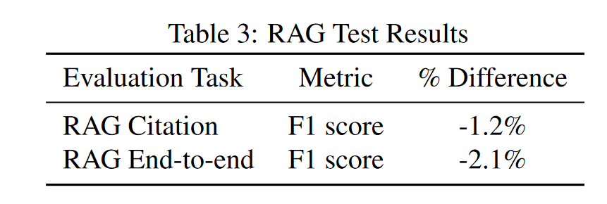
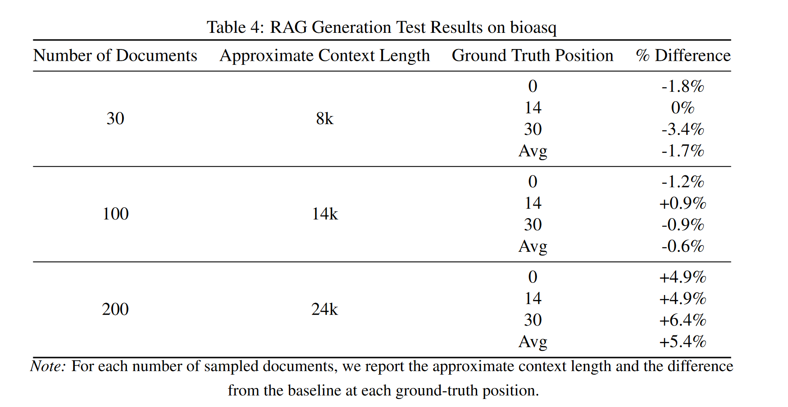

# SnapKV: LLM Knows What You are Looking for Before Generation
模型中的每个注意头在生成过程中始终如一地关注特定的提示注意特征。基于这一思想，SnapKV通过为每个注意力头选择聚类的重要KV位置来自动压缩KV缓存。SnapKV在处理16K个令牌的输入时，获得了一致的解码速度，与基线相比，生成速度提高了3.6倍，内存效率提高了8.2倍。

SnapKV更侧重于超长文本的KV Cache优化。

## 发现
图2是观察窗口选出的重要token和实际生成中的重要token的覆盖率。

图3是不同层之间的覆盖率。

可以看到较高的相似度,由此可以总结两个特点：
* 可以在生成之前识别模式
* 在生成过程中，模式保持稳定

## SnapKV  
观察窗口：prompt的最后一段。该窗口对于分析不同上下文对注意力分配模式的影响至关重要。

前缀长度：观测窗口前的输入长度。

投票：将观察窗口的token作为query所对应的注意力分数求和，得到前缀窗口中每个token在观察窗口中的累计注意力分数。选取前k大的token作为重要token。

命中率：投标出的重要token占所有重要token的比例，用来衡量投票预测的准确程度。

简单描述算法思想就是：观察窗口中的注意力就可以识别出在整个生成过程中的重要token。

此外，还有一个技术细节是：仅仅识别重要token是不够的，会导致丧失信息的完整性。所以作者利用一个池化层来设计了一个聚类算法。

## experiment
### 长文本检索任务：Needle-in-a-Haystack

### 推理延迟实验

### 池化层消融实验

使用了LongEval-Lines任务，比Needle-in-a-Haystack更困难。作者推测关键token簇初始部分被注意力机制赋予了更高的权重，而大模型倾向于复制初始部分周围的标记，以保持上下文的完整性。传统的淘汰策略破坏了这种上下文完整性。

作者实验还发现最大池化和平均池化并没有太大区别

### RAG实验
模型：Command-R

实验项目：
* RAG引用：Cohere的一个内部benchmark
  
* 生成：bioasq数据集
  
* 端到端：HotpotQA dataset，维基百科

