# SparQ Attention: Bandwidth-Efficient LLM Inference
通过使用查询和关键组件的子集来近似注意力分数，在每个生成步骤中只取最相关的令牌，减少了传输数据量。

## 注意力估算
首先给出一般计算一个头的注意力需要的数据传输量
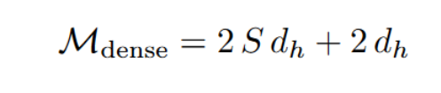

S表示序列长度（Sequence length）,$d_h$表示隐藏层维度

由于注意力分数向量$s$是稀疏的，所以可以认为存在掩码$m_s$使得注意力值存在一个近似，这样就减少了Key向量的传输
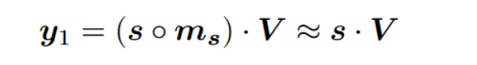

那么问题是如何获得这个掩码（其实就是怎么选key,淘汰不重要的KV）

本文的方法是通过估算注意力分数$\hat{s}$来得出掩码，具体的：
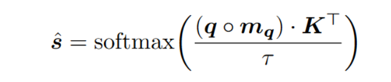

其中$m_q$是根据query的维度特征得到的掩码，它只选取了绝对值较大r个维度，这里的K表述有些问题，并不是指所有的key,而是掩码对应选出来的r个key向量，所以这部分数据的传输实际上是$Sr$。

温度系数$\tau$在这里也需要修改，因为估算的时候并不是所有维度参与了计算，作为一种权衡，$\tau$设置为
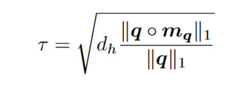

进一步可以得出注意力值计算为：
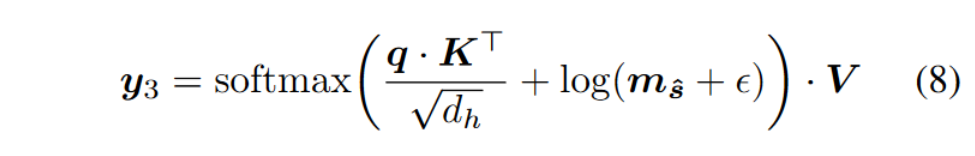

此外，由于部分value值被淘汰，所以作者加入了平均value值来弥补这一部分
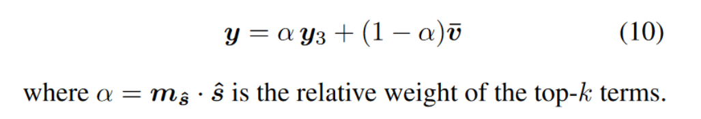

综上，数据传输量应该为：
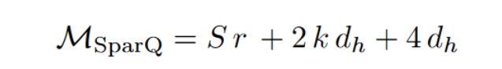

## SparQ Attention
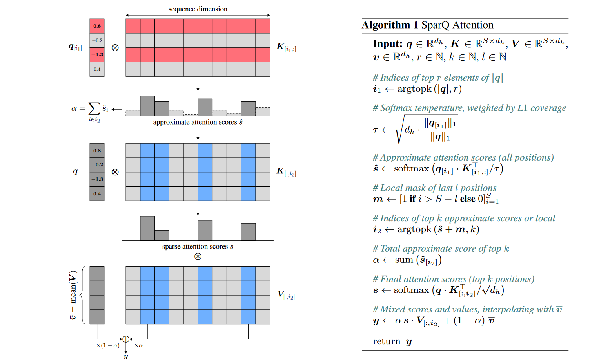

## exp
代码：[SparQ Attention](https://github.com/graphcore-research/llm-inference-research/tree/2024-05-sparq)

任务：SQuAD，TriviaQA，CNN/DailyMail，WikiText，Repetition

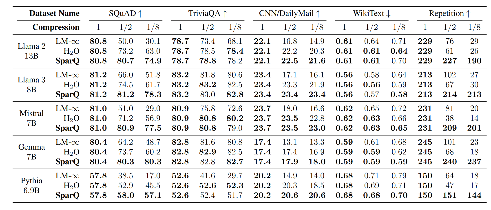

加速效果：
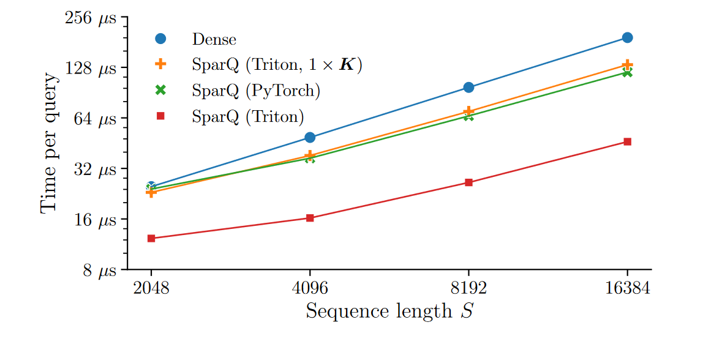

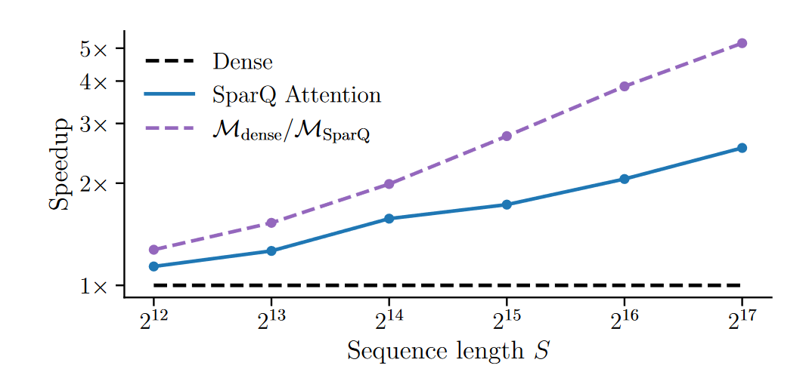

