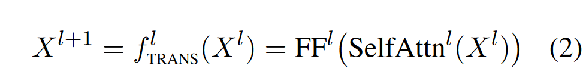

# Transformers are Multi-State RNNs
## transformer是无限状态的RNN
RNN公式

transformer公式

作者定义多状态RNN(MSRNN,Multi-State RNNs)为：

作者认为transformer就是无界的MSRNN

KV对应RNN中的隐藏状态H

## TOVA: Token Omission Via Attention
作者认为尽管LLM的状态是无界的，但在实际中它们往往作为有界MSRNNs。

TOVA的思路是维护一个固定大小的KV Cache,如果KV数量超过了budget,则删除注意分分数最小的token。这个注意力最小是平均每个注意力头的结果。

## Exp
### 对比方案
* window
* window+i  (StreamingLLM)
* H2O
* Full Model(topline)

### 评测项目
#### Language modeling
PG-19由100本书组成，平均长度为70k令牌。

#### Long range understanding
* SQaULITY：ROUGE-1/2/L分数的几何平均值
* QASPER：F1 score

#### Text generation
提示模型生成一个长故事。我们从每个版本的模型中抽样100个独特的故事，使用不同的种子。由于故事之间的比较是困难的，我们采用GPT-4作为评价者

## discussion
不同位置token在Cache中留存步数图，明显初始token留存时间很长

**不是所有的近期token都重要**

在cache中，只有73-76 %的标记是近期的。这表明，虽然近期标记很重要，但还远远不够。重要的是，与现有策略将近期窗口手工保留不同，TOVA是自动识别的。

**某些token留存时间远长于其他token**

