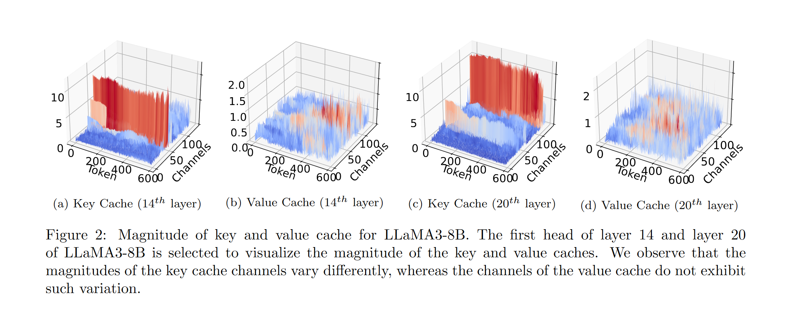
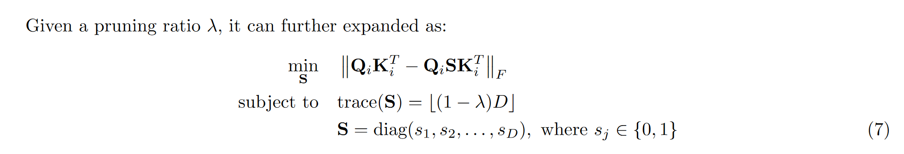
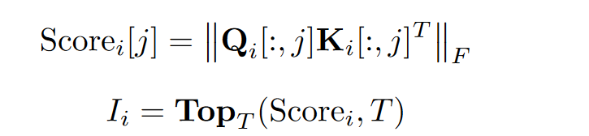
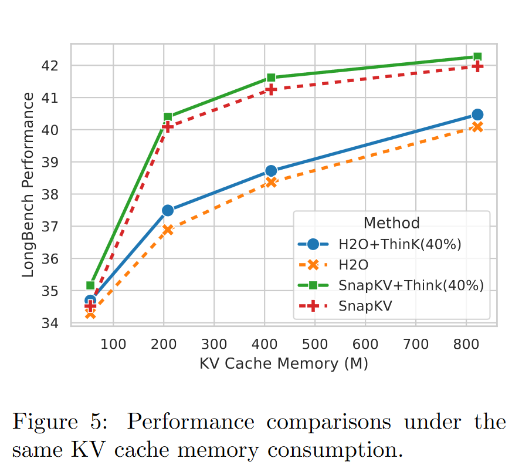
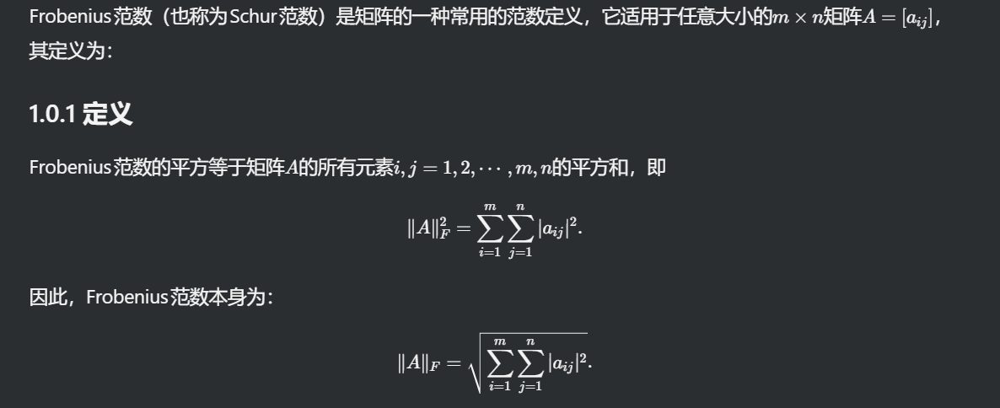

# ThinK: Thinner Key Cache by Query-Driven Pruning

本文通过裁剪特定channel来减少计算量

> 作者应该是受到了kivi的启发，kivi讲的是量化，里面提到了在KV Cache中观察到key的特定channel的值较大的现象

## 观察

可以看到在key Cache中红色的channel有着显著的值，而value cache没有表现出这种现象。 

## 基于query的剪枝

本文的基本思想可以概括为：裁剪特定的channel来减少显存占用

裁剪的目标是最小化注意力分数的差异，这里用Frobenius norm来衡量两个矩阵的差异。

其中S是一个元素均为0/1的对角矩阵，用来表示哪些channel被裁剪掉。 

S使用一个贪心的策略来获得，计算特定channel的Frobenius norm来作为这个channel的得分。下面i是注意力头的index，j是channel的index

作者提到了用snapKV中提到的Observation Window来计算得分，以减少计算量。

## 实现

实现上主要有两个点：

* 不剪枝最近token和新生成的token
* 需要用0填充来保持原有的size。

## 实验

可以和其他token级的淘汰策略相结合，在长文本检索任务中效果较为突出 

## Frobenius Norm

 
