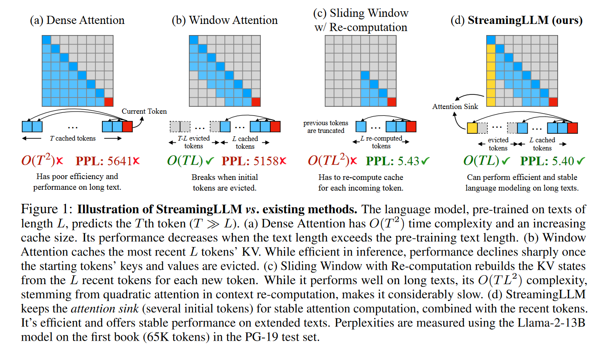

# Attention sink

大量的注意力分数被分配给了初始token，而不管它们与语言建模任务的相关性如何，如图2所示。

Streaming LLM利用了注意力池具有较高的注意力值，保留注意力池可以保持注意力分数分布接近正常的特点。因此，Streaming LLM只需将attention sink中的token的KV (仅用4个初始标记即可满足)与滑动窗口的KV一起保持，即可稳定模型性能。

`obs`:attention sink的注意力分数高在于位置信息而不是语义信息

# ROLLING KV CACHE WITH ATTENTION SINKS
根据cache中的位置来确定位置编码

淘汰初始token和最近token之间token的KV cache

