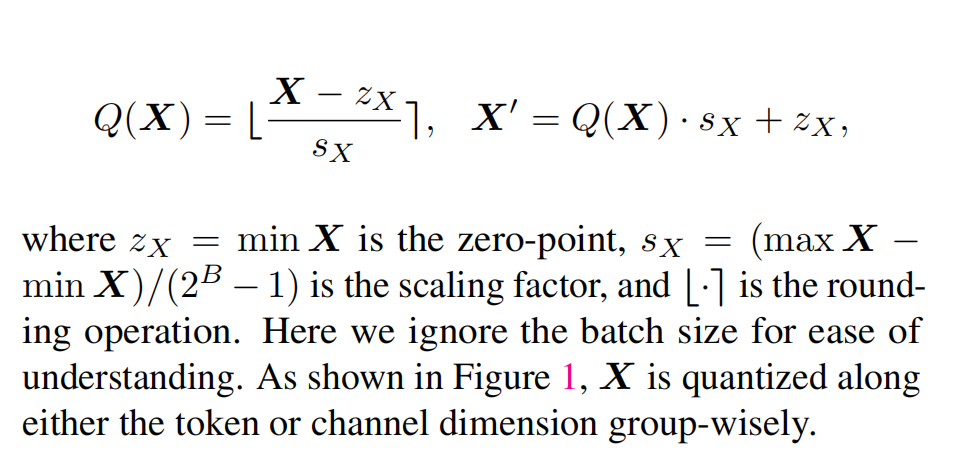

# KIVI
* per-channel 量化key，因为key的特定通道的数值会比较大，这样使得误差限制在每一个独立的通道内，不会影响其他通道
* per-token 量化value，将误差限制在每一个token内

## 量化
量化意思是将浮点数转为int整数来表示，因为浮点数会占据更大的空间，转为整数后可以减少内存占用，但是相应的精度也会有丢失。量化的公式可以表达为

  
## key量化
因为key的量化跨越了token，不能以流的形式直接添加到缓存，所以作者提出了分组的思想，在每组内per-channel量化key，并且把cache分成两部分，一部分叫grouped part，一部分叫residual part，在grouped part中，key是被量化的，而在residual中保持原来的精度，当residual part达到数量R，在执行分组量化，然后residual part清空。

## exp
### 模型
Llama/Llama-2 (Touvron et al., 2023a;b),
Falcon (Penedo et al., 2023) and Mistral (Jiang et al., 2023)

### codebase
Hugging Face Transformers

### task
* we adopt generation tasks from
LM-Eval (Gao et al., 2021) for normal context length evaluation and LongBench (Bai et al., 2023) for long context evaluation, respectively
* For LM-eval, we adopt CoQA
(Exact match accuracy), TruthfulQA (BLEU score), and
GSM8K (Exact match accuracy).
* For LongBench, we chose
1The closed-end tasks such as MMLU are not ideal to evaluate
KIVIsince they only involve one decoding step and directly fetch
the output logits, which is not suitable for studying the impact of
compressed KV cache.
tasks from four subgroups. Specifically, Qasper (F1 score)
is a Single-Document QA task; QMSum (ROUGE score)
and MultiNews (ROUGE score) are Summarization tasks;
TREC (classification score), TriviaQA (F1 score), and SAMSum (ROUGE score) are Few-shot Learning tasks; and LCC
(similarity score) and RepoBench-P (similarity score) is
Code Completion task.