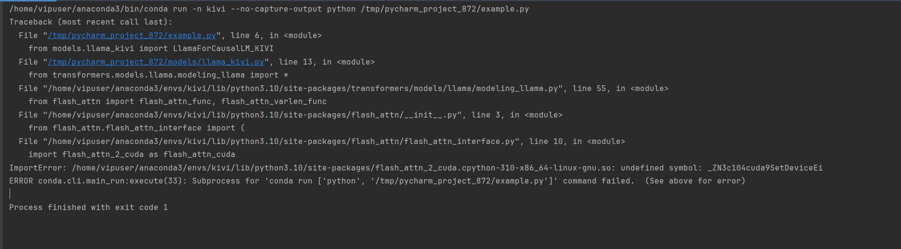

# 机器选择
不用尝试在本地上配置，除非本机配有3090/4090。

llama-2-7b可以尝试在4090上运行


# deepspeed
deepspeed本身有些小毛病
* 不要选win系统
* cuda 12上没有什么问题
* cuda 11需要修改bashrc(注意修改的是当前用户的bashrc)
```
export CUDA_HOME=/usr/local/cuda-11.8
source .bashrc
```

# flash-attn

报错解决：
```
pip install flash_attn -U --force-reinstall
```