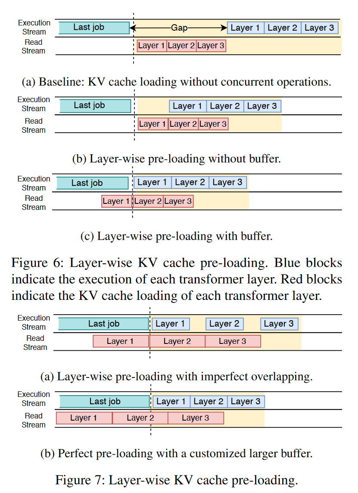
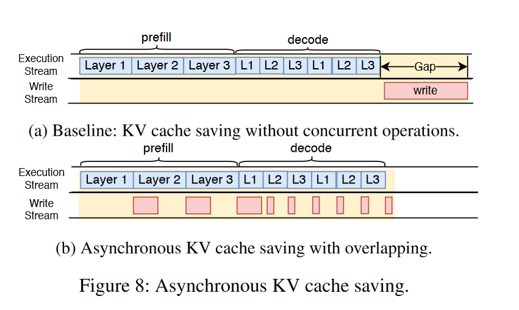
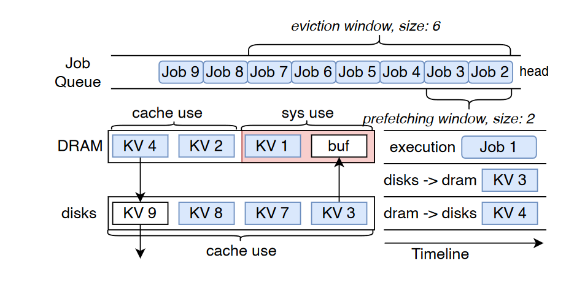

# AttentionStore: Cost-effective Attention Reuse across Multi-turn Conversations in Large Language Model Serving
关注的是多轮对话中对KV Cache的复用以显著减少计算,通过将KV Cache迁移到内存中来避免多轮对话中预填充环节的重复计算。重点是设计存取方案来减少甚至消除显存-内存-磁盘这三层架构中数据迁移带来的时间损失。

## 问题与挑战
1. **高KV缓存访问开销**：在推理过程中，GPU的计算可能因等待从KV缓存系统加载KV缓存而被阻塞。与KV缓存的重复计算时间相比，这种阻塞时间不可忽略。例如，使用4个NVIDIA A100 GPU运行LLaMA-65B模型的推理时间，发现预填充2K个令牌的提示大约需要360毫秒，而从主机内存加载2K令牌（5GB）的KV缓存到GPU大约需要192毫秒
2. **KV缓存的高存储容量需求**：每个请求的KV缓存存储需要大量空间。例如，使用4个80GB HBM的A100 GPU运行LLaMA-65B时，预填充2K个令牌需要大约360毫秒，生成5GB的KV缓存，生成速度约为13.9GB/s。130GB的HBM空间分配给模型存储后，剩余的190GB HBM空间将在14秒内被KV缓存占满。如果将KV缓存溢出到主机内存（例如512GB空间），主机内存将在不到1分钟内被填满。使用磁盘可以扩展存储空间，但会导致访问性能下降。
3. **KV缓存的合适分层放置**：磁盘提供比主机内存更大的容量（数十TB对比几百GB），因此大多数KV缓存保留在磁盘中。然而，磁盘的访问带宽不到5GB/s（PCIe 4.0 x4接口的NVMe SSD）。由于对话请求随机到达，它们的KV缓存更可能位于磁盘中，导致推理性能差。**必须确保即将访问的KV缓存始终放在主机内存而不是磁盘中**。
4. **KV缓存的非预期失效**：随着对话轮数增加，历史令牌可能超过上下文窗口限制。由于截断造成位置编码变化。

## AttentionStore设计与实现
### 分层预加载机制

核心理念：分层预加载机制的核心理念是将KV缓存的加载与新输入标记的预填充计算重叠进行。LLM模型由多个Transformer层链接而成，每层都有自己的KV缓存。当GPU执行某一层时，可以同时从主机内存加载下一层所需的KV缓存。这样，当GPU开始计算某层的自注意力时，该层对应的KV缓存已经在HBM执行缓冲区中准备就绪。

### 异步保存机制
简单的来说，考虑预填充阶段产生大量的KV缓存，而解码阶段产生较慢，所以预填充阶段写入流（write stream）逐层保存KV缓存。为了避免在解码完成时KV缓存未完全写回而导致卡顿，我们保留了一个HBM写入缓冲区，类似于在KV缓存预取中使用的读取缓冲区。未完成的KV缓存暂时移动到写入缓冲区，以避免阻塞下一个任务的执行。

### 调度器感知预取机制
作业调度器维护着一个作业队列，因此可以完全了解等待执行的作业。AttentionStore应用了一个前瞻预取窗口来监视即将执行的等待作业。如果等待作业的KV缓存位于磁盘中，AttentionStore将在这些等待作业执行之前，将其KV缓存从磁盘预取到主机内存中。

### 调度器感知驱逐机制
思路简单来说就是尽量驱逐队列末尾的作业，不驱逐窗口内的作业
### KV缓存截断解耦
传统的KV Cache缓存的是经过位置编码的KV向量，当发生截断时，这种编码便失效了。本文的做法是缓存没有加入位置编码的KV,在推理时再加上相对位置编码。

## 实验
### 硬件条件
4张A100 80GB,128G DRAM,10TB SSDs,GPU通过PCIe Gen 4连接到主机
### 相关技术
* Pytorch实现
* 专用CUDA流来实现数据在内存和GPU之间的传输
* 额外的线程来执行内存和磁盘的数据迁移

### 测试模型
LLaMA-1 model with 65B [44], LLaMA-2 models [45] with 13B, 70B, and Falcon 40B [32]. LLaMA-13B operates on two GPUs with 24 batches, while LLaMA-65B, LLaMA-70B, and Falcon-40B run on four GPUs, handling 24 batches each.

### baseline
每次对话都要重新计算的算法（即一般大模型）

### 实验指标
* Cache命中率
* Time to first token (TTFT)
* 预填充吞吐量
* GPU时间
* 推理价格

## 总结
本文提出了一种新的注意力机制——AttentionStore，它允许在同一对话的后续轮次中重用KV缓存，从而显著减少LLMs中KV缓存的重新计算开销。为了提高AttentionStore的效率，我们设计了重叠KV缓存访问、分层KV缓存放置和位置编码解耦的KV缓存截断方案。大量实验结果表明，AttentionStore显著降低了TTFT（最多达88%），并将多轮对话的提示预填充吞吐量提高了8.2倍。同时，它将端到端推理成本降低了最多56%。此外，对于长序列推理，AttentionStore将TTFT减少了最多95%，并将提示预填充吞吐量提高了22倍。