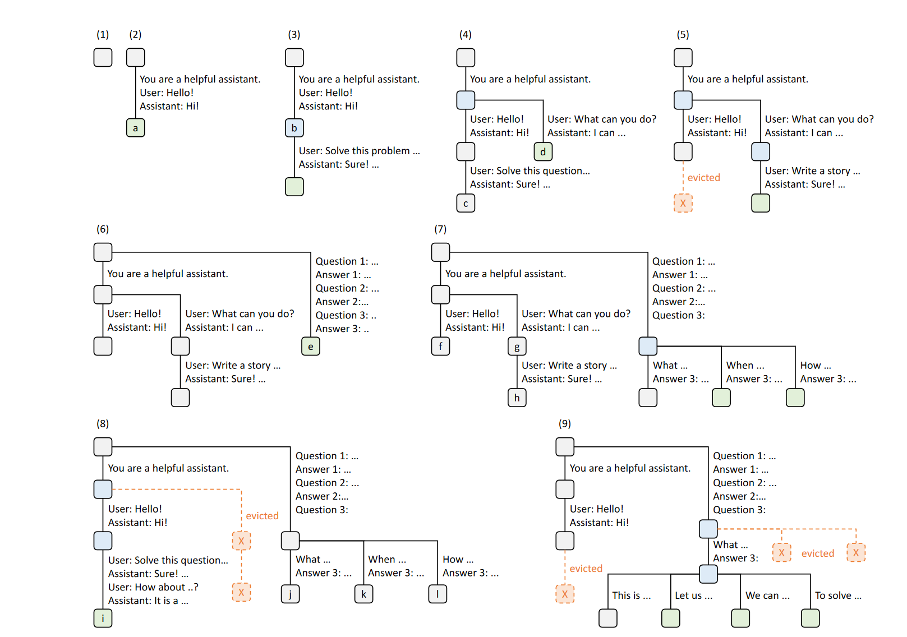

# SGLang: Efficient Execution of Structured Language Model Programs

本文主要针对有格式化输出需求的场景，通过构建树来管理缓存，实现不同对话之间KV Cache的复用。

## RadixAttention
KV缓存中存储了生成推理过程中至关重要的可重用中间数据。在LM程序的批量执行过程中，如果有多个大型语言模型（LLM）调用共享了相同的前缀，那么理论上可以多次重用KV缓存中的数据。然而，现有的系统却缺乏有效的机制来支持这种重用，结果导致了大量的重复计算和内存浪费。

许多推理引擎在完成一个请求的处理后就会丢弃其KV缓存，导致这一宝贵资源无法在多次请求间共享，从而拖慢了执行速度。而我们的系统则创新性地为所有请求在基数树结构中维护了一个基于最近最少使用（LRU）原则的KV缓存。这样，我们不仅将KV缓存管理得像传统缓存一样高效，还利用基数树实现了缓存的快速匹配、插入和替换。通过这种方式，我们的系统能够更智能地处理各种缓存复用模式，显著提升执行效率。
