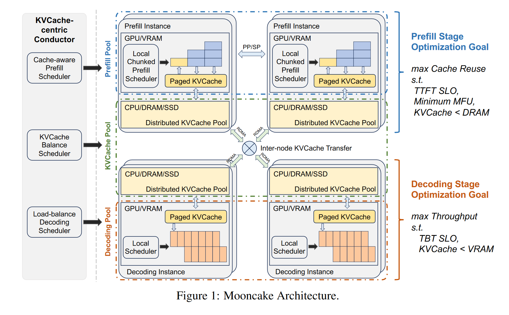

# Mooncake: A KVCache-centric Disaggregated Architecture for LLM Serving
## 评价指标
这篇文章提到了大模型部署的一些服务指标，在这里整理一下
|指标|含义|
|---|---|
|Service Level Objectives (SLOs)|服务级别指标|
|TTFT|第一个token用时|
|TBT|token之间用时|
|Model FLOPs Utilization (MFU)|GPU算力利用率|

## 问题
1. 高度超负荷的场景，需要处理大量请求。

2. 需要在满足延迟SLA的同时，最大化整体有效吞吐量。
   
## 框架概述
预填充服务器与解码服务器分开，因为这两个阶段的计算特性非常不同，KVCache 会随着请求从预填充服务器转移到解码服务器。

为了提高整体吞吐量，通常有两种方法：1）尽可能多地重用 KVCache，以减少所需的计算资源；2）最大化每个批次中的token数，以提高模型 FLOPs 利用率（MFU）。

然而，从远程重用 KVCache 会延长TTFT，而较大的批次大小会导致更大的TBT。因此，面向吞吐量的优化可能会导致违反与延迟相关的 SLOs。

根据上述指导原则，我们提出了一种以 KVCache 为中心的解耦设计，用于调度和优化。图1展示了我们当前用于 LLM 服务的 KVCache 中心解耦架构，名为 Mooncake。对于每个请求，全局调度器（Conductor）需要选择一对预填充和解码实例，并按以下步骤调度请求：
* 1）将尽可能多的可重用 KVCache 转移到选定的预填充实例；
* 2）以块/层的方式完成预填充阶段，并将输出的 KVCache 连续流式传输到相应的解码实例；
* 3）加载 KVCache，并将请求添加到解码实例的连续批处理过程中以生成请求输出。

在预填充阶段，主要目标是尽可能让解码阶段重用KVCache，以避免冗余计算。然而，等待存储在低层存储中的KVCache可能会违反首token延迟SLO。此外，对KVCache服务器的高需求可能会导致网络拥塞，延长等待时间。因此，Conductor还负责预测KVCache块的未来使用情况，并相应地执行调度操作，如交换和复制。最热门的块应该复制到多个节点，以避免提取拥塞，而最冷的块应该被交换出去，以减少保留成本。预填充调度还受到预填充节点内存空间的约束，特别是当大部分内存被全局KVCache池保留时。

## 以KVCache为中心的调度
提出了一种考虑前缀缓存预填充时间和实例负载排队时间的缓存感知全局调度算法。

虽然倾向于将请求路由到具有较长前缀缓存长度的预填充实例以减少计算成本，但将其调度到其他节点以确保整体系统平衡并满足TTFT SLOs可能也是有益的。
### 预填充全局调度
对于每个新请求，其输入令牌被分成多个块，并为每个块计算一个哈希键。这涉及生成一个令牌块的哈希键，该键与前一个块的哈希键（如果有）连接起来。然后，请求的块键逐一与每个预填充实例的缓存键进行比较，以识别前缀匹配长度（pref ix_len）。

**根据匹配信息，Conductor根据请求长度和pref ix_len（按实例变化）估算相应的执行时间**。然后，它将该请求分配给TTFT最短的实例，并相应地更新该实例的缓存和队列时间。

### Cache负载均衡
从分布式缓存系统的角度来看，负载平衡也起着重要作用。具体而言，它涉及制定策略如何备份缓存，以确保全局预填充调度既能实现高缓存命中率又能降低负载。

由于实例负载高，请求可能并不总是被发送到具有最长前缀缓存长度的预填充实例。在这种情况下，Conductor会将缓存位置和请求转发给备用实例，如果估计的额外预填充时间短于传输时间的话。该实例会主动从持有者处检索KVCache并将其存储在本地。更重要的是，我们倾向于计算输入令牌，如果最佳远程前缀匹配长度不大于当前本地可重复前缀乘以一个阈值。

## 过载调度
## 早期拒绝
在实际应用中，预填充或解码实例上的个体负载并不能准确反映系统处理的实际请求数量。这种差异是由于对单个请求调度预填充和解码实例之间存在时间滞后所导致的。如果一个请求由于解码实例负载过高而在预填充阶段完成后被拒绝，那么在预填充阶段消耗的计算资源将会被浪费。

为了解决这个问题，提前评估解码实例的负载以优先于预填充阶段的开始是自然而然的做法。我们称这种策略为早期拒绝。在收到请求后，Conductor根据预填充池和解码池之间的较大负载来评估是否接受请求。早期拒绝显著减少了由于被拒绝请求而导致的无效计算，并增强了负载均衡。
