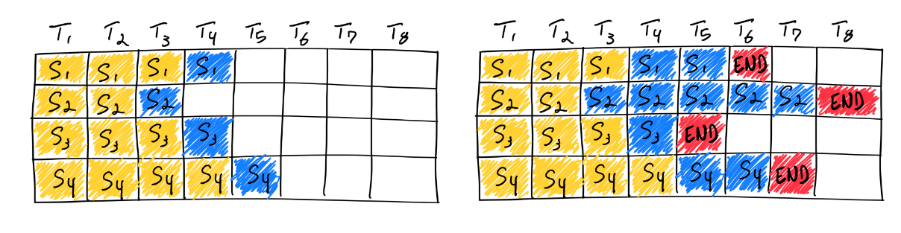
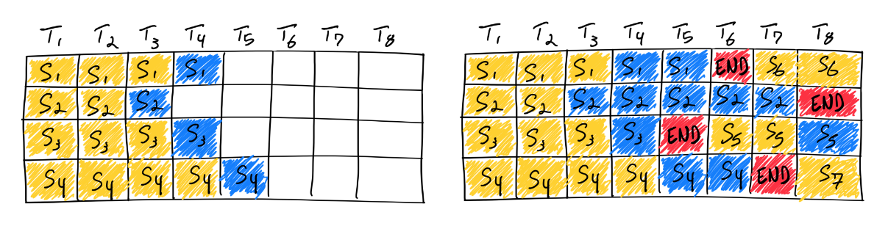

# 连续批处理（continuous batching）

## 静态批处理
我们称这种传统的批处理方法为静态批处理，因为批处理的大小在推理完成之前保持不变。以下是在 LLM 推理环境中静态批处理的一个示例：

使用静态批处理完成四个序列。在第一次迭代（左边）时，每个序列从提示 Token（黄色）生成一个 Token（蓝色）。经过几次迭代后（右边），已完成序列的大小各不相同，因为每个序列在不同的迭代中发出其序列结束 Token（红色）。尽管序列 3 在两个迭代后完成，但静态批处理意味着 GPU 在最后一个序列（本例中为序列 2）完成生成之前会处于低利用率状态。

## 连续批处理
业界认识到了这种低效率，并提出了更好的方法。《Orca: A Distributed Serving System for Transformer-Based Generative Models》是OSDI '22中呈现的一篇论文，它是我们所知道的第一篇研究解决这个问题的论文。Orca并不等到一个批次中的所有序列完成生成，而是实现了迭代调度，批次大小在每次迭代中确定。这样，一旦一个批次中的序列完成生成，就可以将一个新序列插入到它的位置，从而实现比静态批处理更高的GPU利用率。

使用连续批处理完成七个序列。左图显示了一个迭代后的��次，右图显示了经过几次迭代后的批次。一旦一个序列生成了一个序列结束标记，我们就在它的位置插入一个新的序列（如序列S5, S6和S7）。这样可以实现更高的GPU利用率，因为GPU不必等待所有序列完成才开始新的序列。
实际情况比这个简化模型更复杂些：由于预填充阶段需要计算，并且具有与生成标记截然不同的计算模式，所以无法与生成标记轻松地进行批处理。当前的连续批处理框架通过超参数来解决这个问题：waiting_served_ratio，它表示等待预填充的请求与等待序列结束标记请求的比率。

## GPU性能衡量
来自于NVIDIA官网，主要解释了计算强度，判断是计算受限还是IO受限
https://docs.nvidia.com/deeplearning/performance/dl-performance-gpu-background/index.html#understand-perf

//todo
## 语义熵

