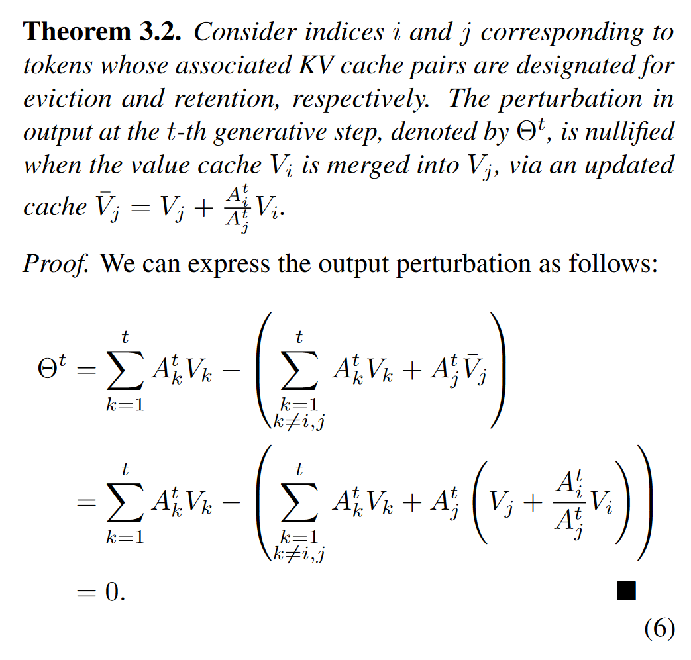
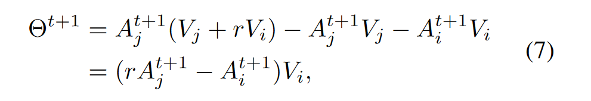

# CaM: Cache Merging for Memory-efficient LLMs Inference
这篇论文提出了一种将merged token平均merge到保留token的压缩方法

理论上来说，如果分配了合理的merge rate,可以实现无损的输出。merge前后的损失很大程度上取决于被驱逐token和保留token的注意力比例。

## Method
$\Delta ^t $表示了驱逐所产生的注意力损失，i标号在论文里表示被淘汰token的标号

而merge所能产生的理论损失为0。这里采用了被驱逐的注意力和融合token注意力的比值作为merge rate。

更一般地，merge rate用r表示，则误差为

比较$\Theta^{t+1}$和$\Delta ^t $可以发现merge rate在最坏情况下会比淘汰策略的误差还要大。所以，merge rate的优化方法里，不仅要最小化$\Theta^{t+1}$，还要确保$|\Theta^{t+1}|-|\Delta ^t|<0 $

然而在一层层的前向传播中，很难去预测r的理想值（即注意力比例），然而作者发现了一定长度的序列的平均注意力随着层数加深是稳定的。

所以作者提出并不是让淘汰token merge到一个保留token上，而是平均地merge到最近的所有token上。

误差可以表示为：

所以需要让$A_i^{t+1}$和$avg(A_{j:j+m}^{t+1})$尽可能接近

作者用伯努利采样来决定是否merge,采样的概率则是累积注意力的比例（依旧是用累积注意力来预测当前的注意力）

此外，作者还证明了

这一条件被自然地包含在伯努利采样中。

## exp
只保留20%的Cache

任务表现均超过StreamingLLM，H2O,Scissorhands

吞吐和显存占用与StreamingLLM相近

