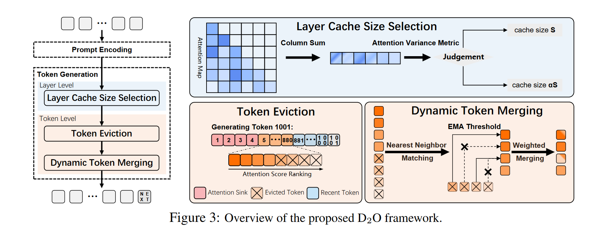
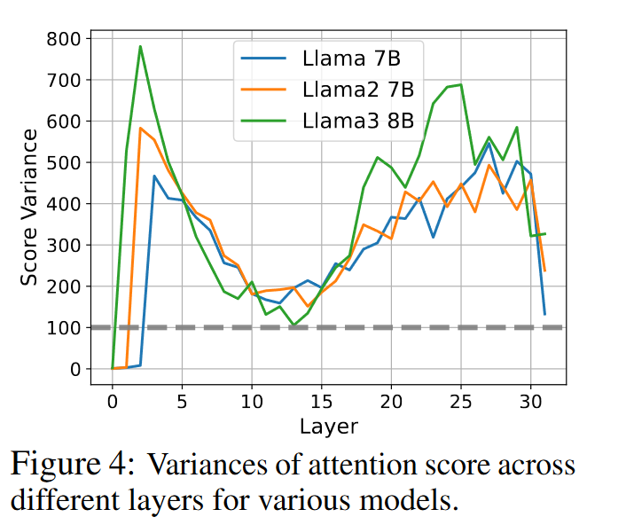
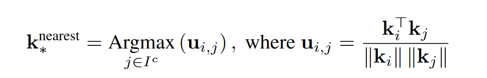
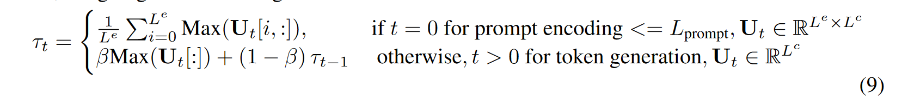
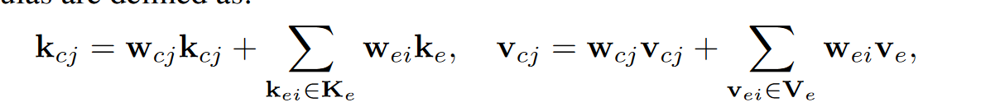
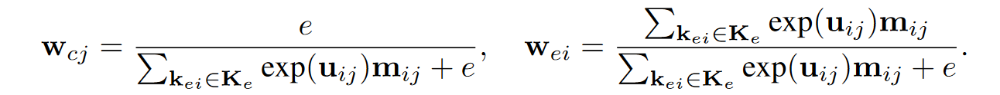
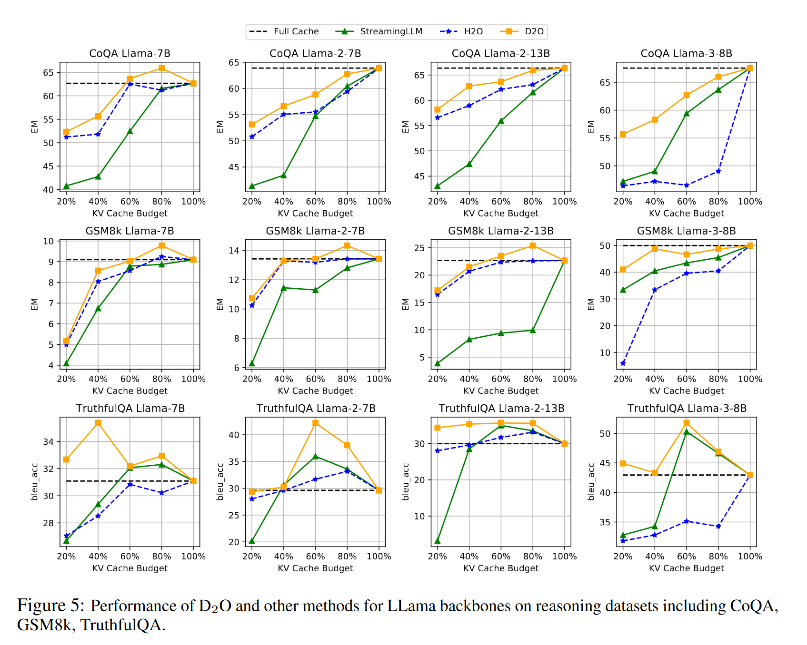
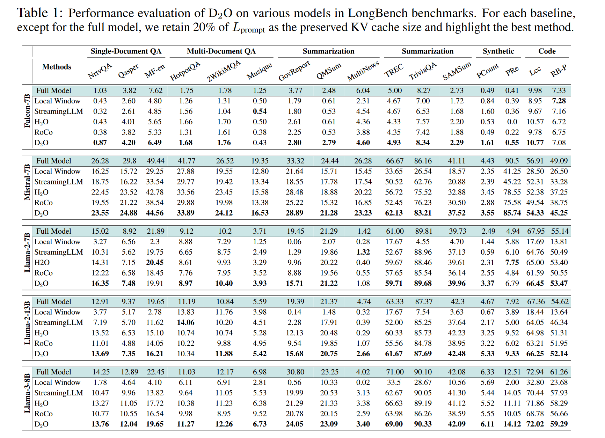
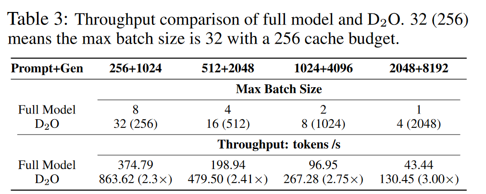

# D2O: Dynamic Discriminative Operations for Efficient Generative Inference of Large Language Models
利用两级判别策略：层级和token级，来优化KV缓存大小，而无需微调，同时保留必要的上下文。

## 方法

### 1. 层级判别
根据不同层中注意力权重的稠密程度来确定哪些层需要避免过度的淘汰。这里作者用方差来作为评判稠密程度的标准。

通过设置门系数$g$来调整KV缓存大小：方差大于$g$的层分配较小的缓存大小$S$，而方差较小的浅层分配较大的缓存大小$\alpha S$，其中$\alpha$是相对于$S$的缩放因子。

### 2. token级判别
首先D2O采用了之前研究普遍采用的淘汰策略：累计注意力分数，在此基础上，对于淘汰的token,D2O进一步考虑了是否要融合来减少淘汰token带来的损失。

与一般融合策略一样，需要计算淘汰token与留存token之间的相似度。根据下面公式的计算，选出与留存token最相似的淘汰token，然后进行融合。

但是并不是对所有的淘汰token都融合，作者提出用EMA（exponential moving average）阈值来确定淘汰token是永久驱逐还是进行融合。EMA阈值定义为:

这个公式的含义是：在预填充阶段采用淘汰token的最大平均相似度来作为EMA阈值；在解码阶段，需要有一个衰减系数$\beta$来平滑历史信息。这个公式强调了当前被驱逐令牌和保守令牌之间最近相似性的重要性，同时平滑了先前被驱逐令牌和保守令牌之间的历史相似性信息。

如果当前被驱逐令牌的最大相似度小于$\tau_t$，则永久丢弃。否则，使用加权融合策略（目前认为表现最好的融合方法）。

### 权重融合
融合公式：

这里提出的权重计算有些不同，采用了类似softmax的指数计算。

其中$m_{i,j}$是01掩码，用来表示留存token和淘汰token是否是最相似的。

## experiment
D2O与SOTA的对比：

任务测试：

D2O对于batch size和吞吐的影响：

