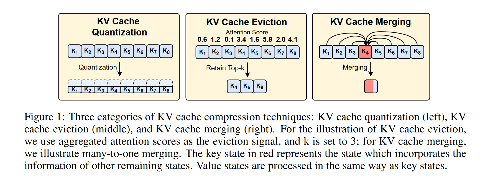
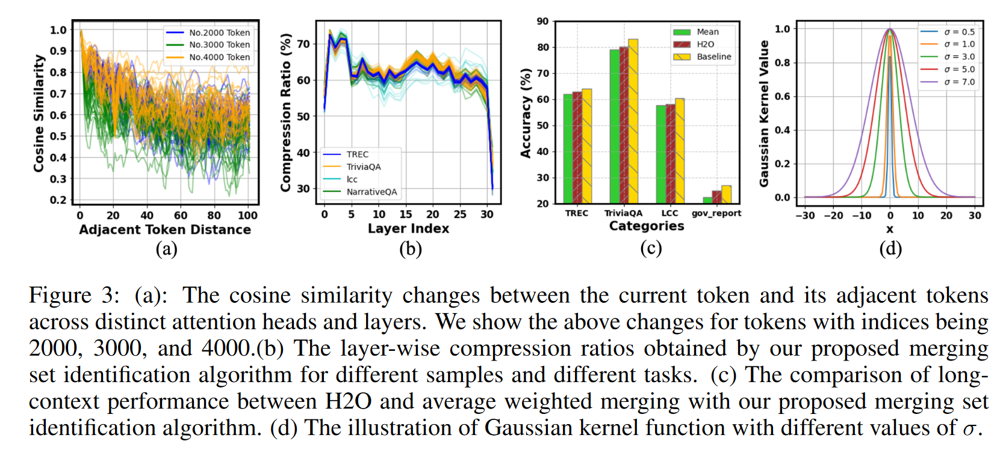
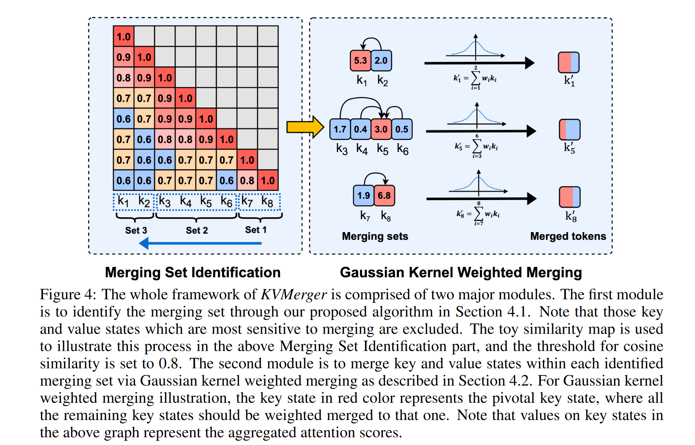
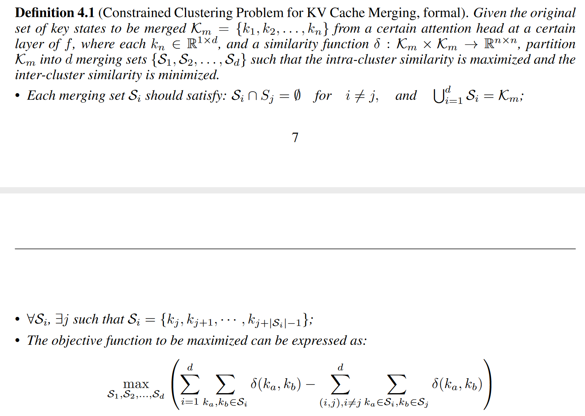
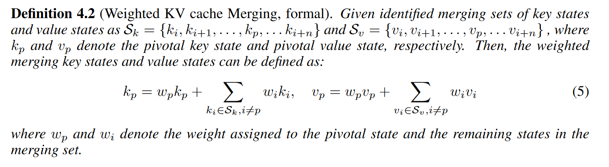
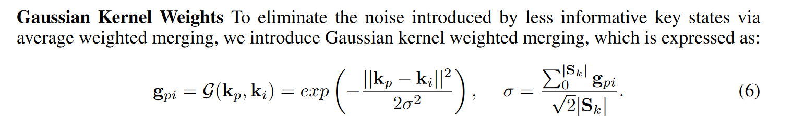
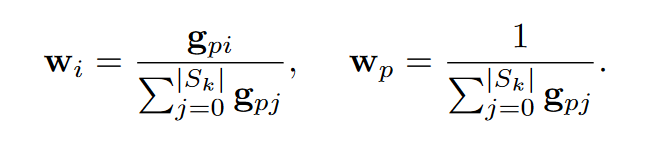

# MODEL TELLS YOU WHERE TO MERGE: ADAPTIVE KV CACHE MERGING FOR LLMS ON LONG-CONTEXT TASKS

简单来说，KV融合指得是将几个state融合到一个state来表示

## 发现
key在不同层的不同注意力头中，都表现出了一个特征：临近token有高度的相似度

作者从实验和理论两个角度证明了这种相似性，并且将这种相似性归于RoPE,因此在Value中并没有表现出这种相似性

观察到的静态KV cache稀疏性表明，可以通过调整余弦相似度阈值来确定逐层压缩比，从而减少KV cache内存消耗。并且可以发现在前面的层数和最后的层数中，注意力分数的分布会更加的均匀。

## 算法设计
算法包括两个步骤，首先是对mergint set进行分组，然后再高斯核权重融合

### GREEDY POLICY FOR MERGING SET IDENTIFICATION

### GAUSSIAN KERNEL WEIGHTED MERGING
第一个因素是枢纽状态的选择，所有其他状态都被合并到枢纽状态。第二个因素涉及到为每个状态分配权重，其中枢轴状态具有最大的权重来保存信息。

枢纽key的选择采用常见的累计注意力分数

高斯核可以为相近的token赋予更大的权重

对于合并value，$w_i$和$w_p$要乘以$|S_v|$。这种调整是由于在合并过程中需要准确地反映价值状态的数量，以确保合并结果准确地代表每个价值状态的贡献。