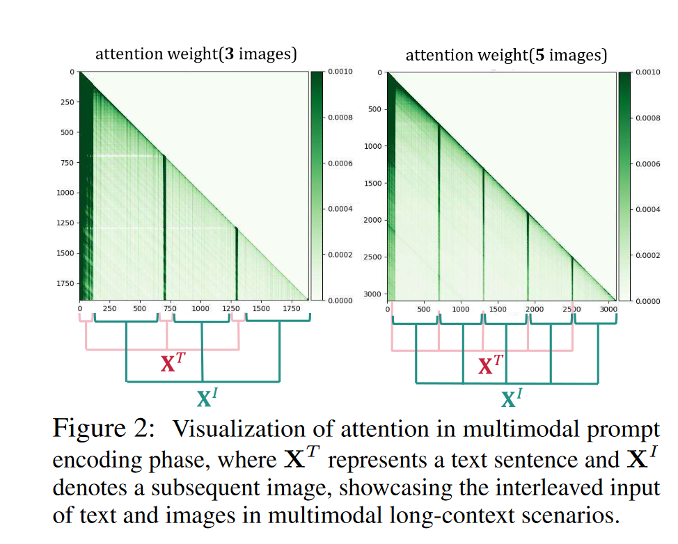
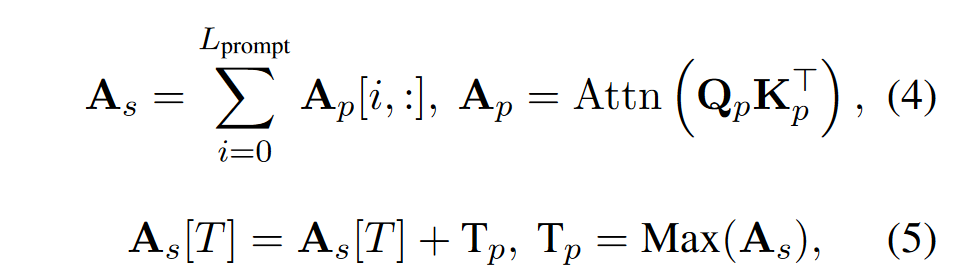
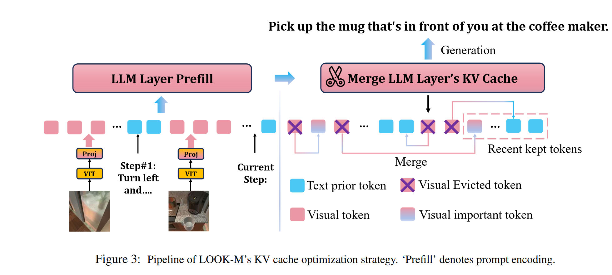
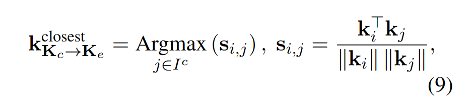
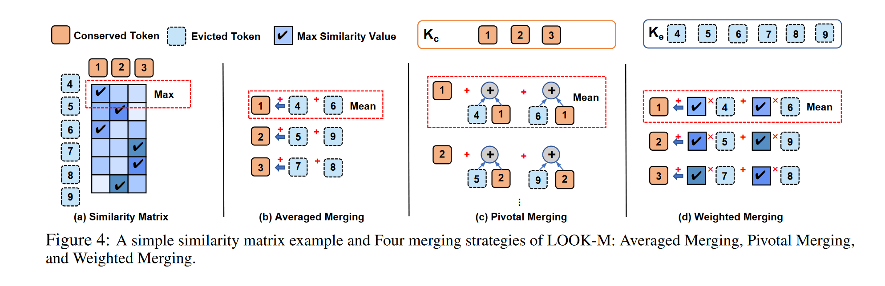
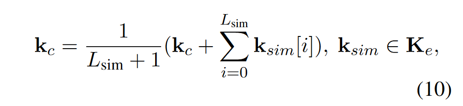
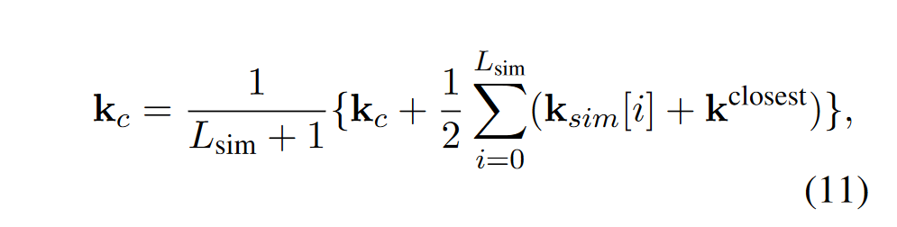
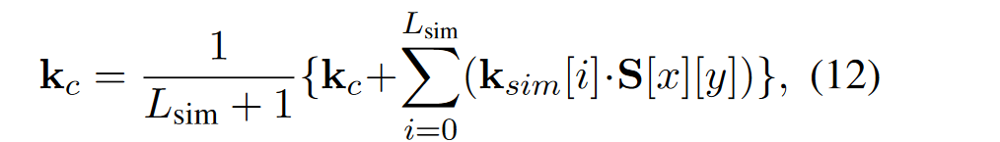
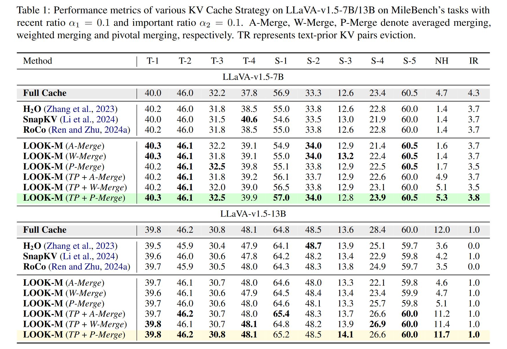

# LOOK-M: Look-Once Optimization in KV Cache for Efficient Multimodal Long-Context Inference
本文是一篇针对长上下文多模态推理的KV Cache优化，采用了KV融合的方法

## 主要思路
### 文本token更重要

图中$X^T$表示文本token,$X^I$表示视觉token。观察可以发现，文本token得到了更高的注意力分数，突出了保留文本特征的必要性，有选择地剪枝多模态KV缓存中的冗余图像token，以保持多模态上下文的完整性。

作者对所有文本token对应的注意力分数都强行加上注意力分数的最大值来强调文本token。T表示文本token对应的索引。

### 视觉token
用H2O的方法来淘汰

### 融合淘汰token

为了缓解淘汰token造成的信息丢失，作者探索各种策略来融合淘汰的token。首先需要将淘汰token分组，与特定的留存token组成一个融合分组。分组的方法是计算出淘汰token与留存token之间的相似度，然后根据相似度将它们分组。相似度计算方法如下：

其中，$K_c$表示留存token的key集合，$K_e$表示淘汰token的key集合。

具体的融合策略有平均融合、枢纽融合和权重融合

#### 平均融合 

#### 枢纽融合
枢纽融合强调了留存token的重要性

#### 权重融合

## experiment
Code: [LOOK-M](https://github.com/SUSTechBruce/LOOK-M)

数据集：MileBench

模型：LLaVA-v1.5-7B/13B

