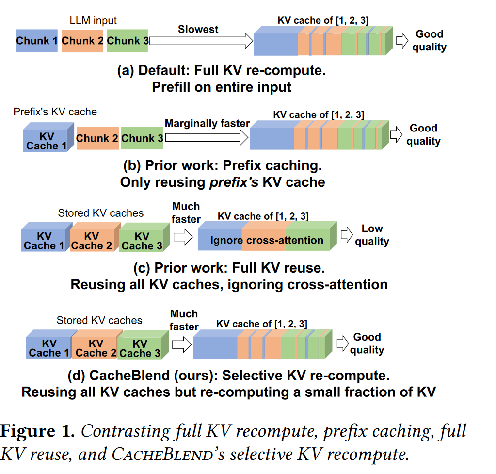
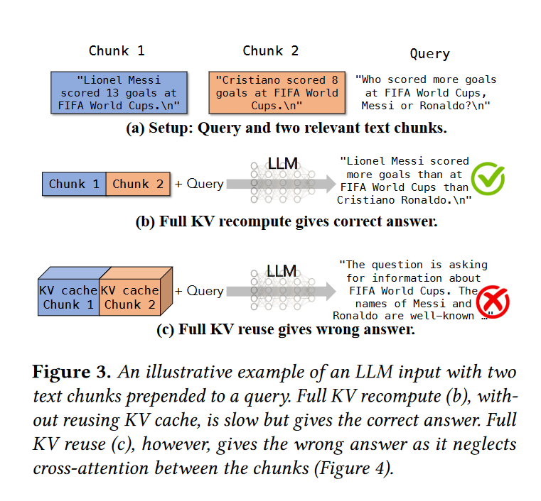
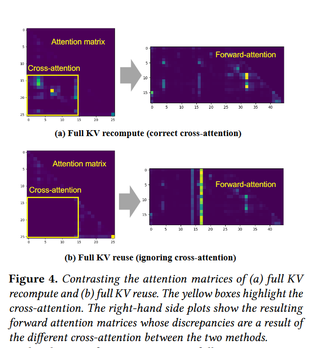
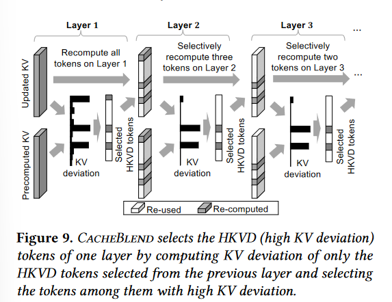
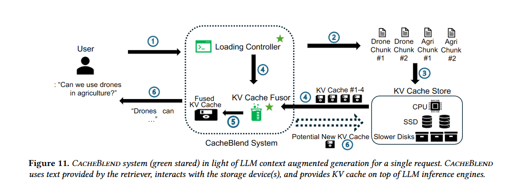
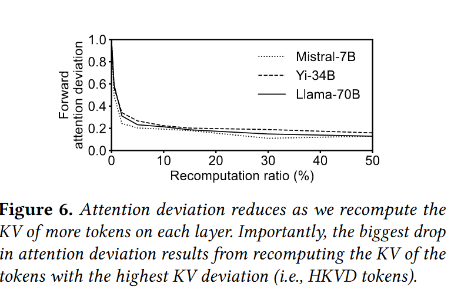
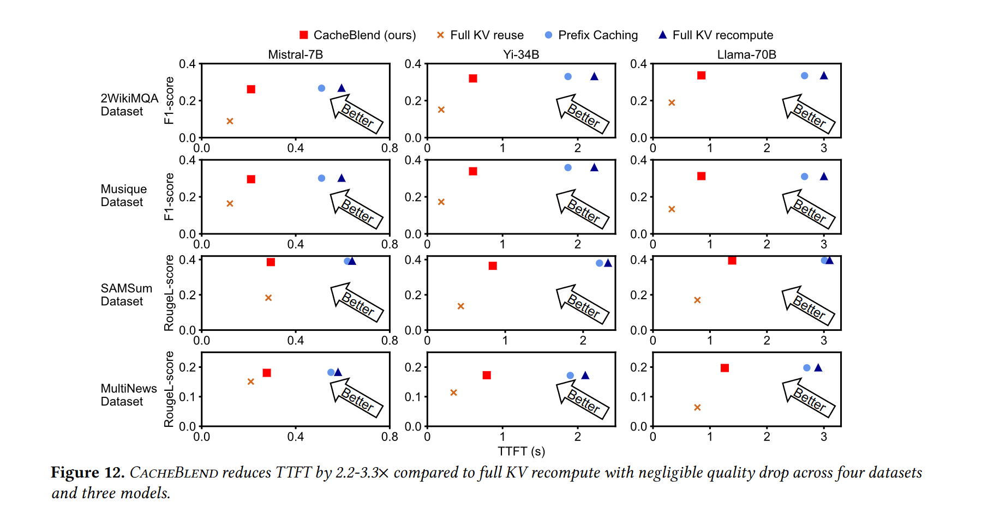

# CacheBlend: Fast Large Language Model Serving for RAG with Cached Knowledge Fusion
这篇难以分到某个具体的类别，实质上并没有在KV Cache显存优化上做什么文章，主要解决的问题是在RAG场景中，对文档进行分块做预填充所产生的误差。

## background
在RAG场景中，相同的文档被不同的LLM输入所利用。所以这些重复文档的KV cache只计算一次，
然后在不同的输入中重复使用。

目前RAG场景中几种KV Cache的重用方法：

(a):常规方法，全KV重计算，即不进行KV缓存
(b):只利用前缀的缓存KV。
(c):分块重用KV Cache
(d):CacheBlend，本文提出的方法

前两种的缺陷是很明显的，效率低。

分块计算有个很明显的缺陷是没有实现块与块的注意力计算（cross attention），只在块内进行注意力计算。如果遇到需要联合几个块来回答的情况下，会出现误差。例子如下：

再来看注意力矩阵：

原本的full kv计算的左下角应该是有注意力分数的，
但在做分块计算的时候，没有做cross attention，
所以在分块计算的注意力矩阵中，左下角直接就缺失了。
这样导致了在做前向注意力时（后缀作为query，前缀作为key），注意力矩阵也发生了变化。

## method
### 术语
KV偏差：定义为分块计算的KV Cache和全KV计算之间KV的L2距离

注意力偏差：分块计算与全KV计算注意力的L2距离

目标是最小化注意力误差

### 选择重计算KV
简单来说，期望的目标是恢复在注意力矩阵中缺失的左下角，其实也就是选择在左下角区域具有较高注意力分数的token加入到其他块的计算中。

理想的目标是重计算那些具有较高注意力误差的KV,但实际上是不可行的。
但是有一个发现：重计算具有较高KV误差的token，可以减少注意力误差。

所以问题就变成了选择具有较高KV误差的token来重计算。
但实际上KV误差也是无法在预填充过程中拿到的，所以还是在用上一层的注意力误差来代表当前层，
即认为在上一层中误差大，在这一层中也可能误差大。
> 有个疑问的地方是第一层中的高偏差KV是如何选取出来的，第一层难道不是不存在偏差吗？？？

由于前面的层对于选择高误差KV并不可靠，所以采用一种逐层过滤的方法：

### 系统设计
* 权衡KV loading和recompute,确保KV loading能够隐藏recompute的时间
* 根据存储设备来选择重计算比例
> 通过估算重计算时延和loading时延，首先选出能够cover掉重计算时延的参数，然后再和确保生成质量的最低重计算比例对比，选择较大的那一个参数作为重计算比例。

## exp
重计算比例对前向注意力偏差的影响：

主要在生成质量上和TTFT上有比较大的优势

